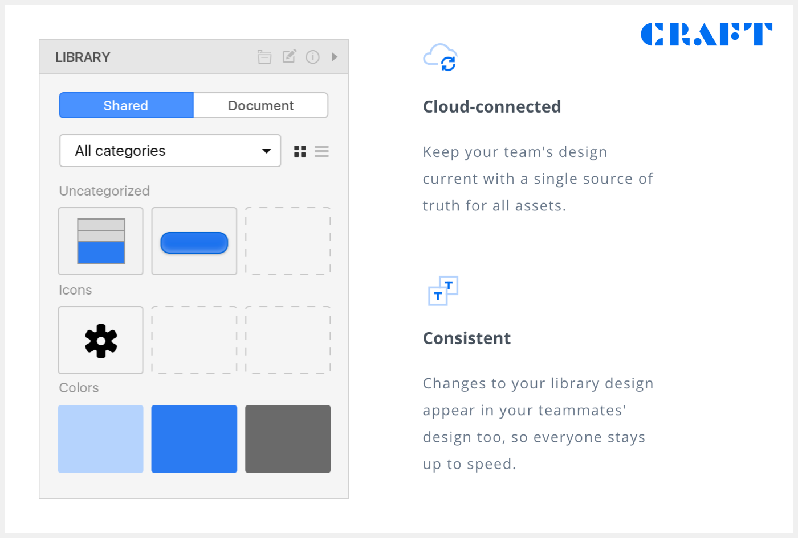
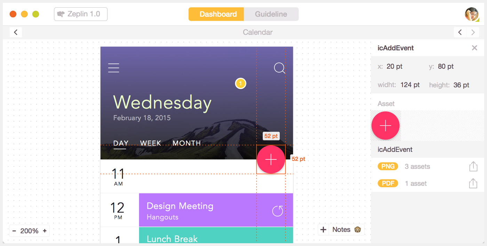
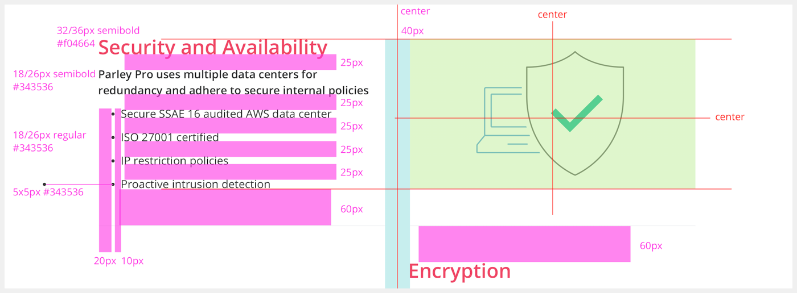
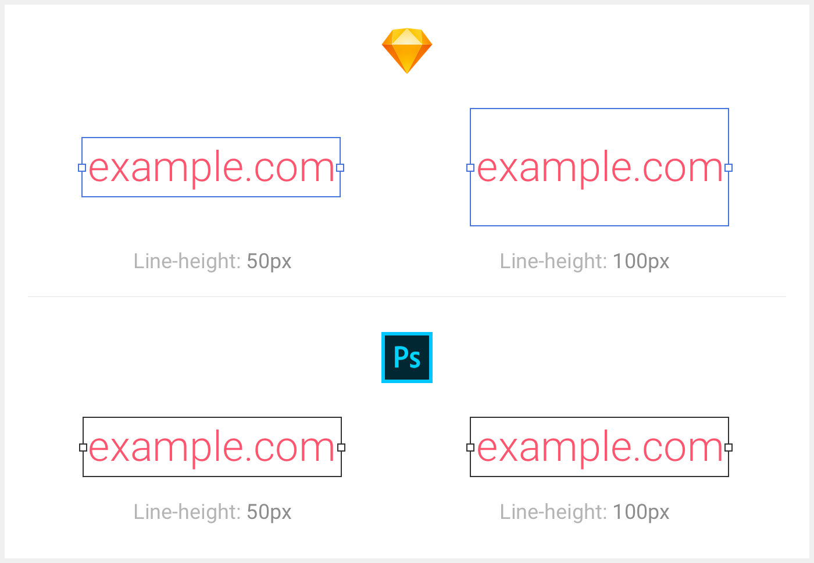
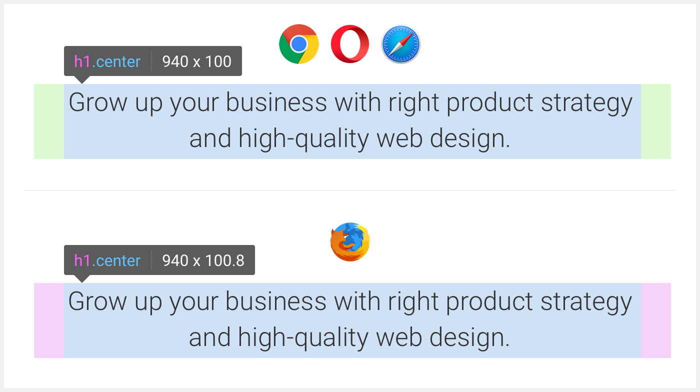
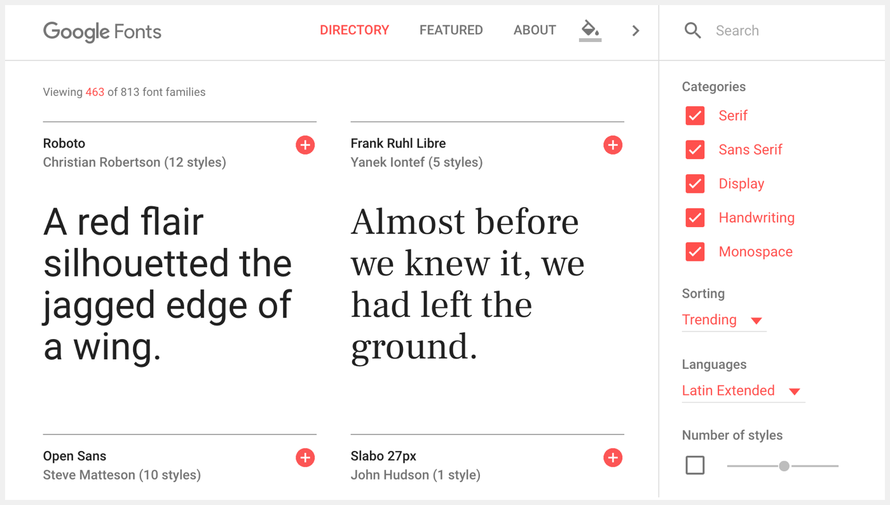

## UI kits

A UI kit is a list of all the elements you are using in a project. This kit helps you keep everything in its actual state, and makes the maintenance process easier when you work with a team on big projects.

In a UI kit, you should illustrate your project’s: colors; typography; components like buttons, inputs, and sliders; and different states like hover, active, and default. Use the D.R.Y. (“Don’t Repeat Yourself”) principle when you consider whether or not to place a given element in the UI kit. If you have two similar elements in the artboards, move one to a UI kit. In the artboards of designers who do not use UI kits, you will usually find two, three, or four different buttons with very small and irrelevant differences. In these cases, the developer will probably implement all of them instead of creating one unified version.

We recommend Craft for creating your project’s UI library. For larger projects, it is a good idea to have an HTML and CSS version of a UI kit, and use them as a reference for other elements.

## Export

Make the developer’s life easier and increase your chances of building a pixel perfect design by using one of these tools:

- [Invision Inspect](https://www.invisionapp.com/feature/inspect)
- [Zeplin](https://zeplin.io/)
- [Sympli](https://sympli.io/)
- [Sketch Measure](https://github.com/utom/sketch-measure)

They can help you retrieve colors, fonts, sizes, assets, distance between elements, CSS properties, and other stuff from your Sketch or PSD. Invision and Zeplin also let you write in notes instead of forcing you to create additional layers, like Photoshop.

## Element states

To prevent misunderstandings, we recommend that you use specific terminology for the different states of your elements, just as we do in CSS. Developers will know what you’re talking about without excessive explanations.

- **Default**
- **Hover**: The state of the element with a mouseover
- **Active**: The state of the element upon pressing
- **Focus**: The state of element that is currently targeted by the keyboard, or activated by the mouse (i.e. inputs, text areas)
- **Visited**: The state of the links that have already been visited

## Line-height

Line-height is a very important part of your design and handoff process. The most important thing here is to understand how a browser will render each element, and how line-height will affect it. Take a look at the picture below. This is a typical example of a text block rendered by a browser. The height of that element is the same as the line-height and the height of different characters not in line with the element as a whole.

One advantage of using Sketch is that it renders text objects with the same logic. Photoshop element sizes do not depend on line-height.

Best practice dictates using line-height similar with fonts. Don’t use a lot of different, custom line-heights across the site. Every font has a default value of line-height. For example, Roboto has 1.4x line-height of font size; if you have a font size of 16px, line-height will be 22px. Even if you decide not to use the default value, try to use the same proportion across the entire site. Typical values are 1.3–1.6 of font sizes. Developers will like this, because they prefer to define the global line-height value and forget about it, continuing to work with just font sizes.

Now, a little bit about behavior with float numbers in different browsers. For example initial values:

- Font size: 36px
- Line-height: 1.4

Chrome, Safari, Opera: Calculate only integer values and truncate float. 36px \* 1.4 = 50.4, and will be truncated to 50px.

Firefox: Calculate with float. 36px \* 1.4 = 50.4, and it will remain 50.4px. If you have two lines of text like in the example below, it will be 100.8px. The main difference with Safari and Chrome is that if you pick a line-height like 1.41, you will get 100px; in Firefox, it will be a 101.533px container size.

The takeaway here is that Firefox uses more accurate line-height values, like 1.33333. If that doesn’t concern you, stick with pretty and clean numbers, like 1.3.

## Fonts

First, try to find acceptable fonts at Google Fonts. Browsers support different formats of fonts. This means that to use certain custom fonts, the developer will need to prepare them with special services to convert ttf/otf to woff, woff2, or eot. During that process, fonts can lose quality. So, my recommendation is to use custom fonts only if you know that your developers will not fail in the process. They must know how to work with fonts.

Here are couple things to remember about using fonts:

- Don’t use more than two fonts. This will affect page loading times, especially if the fonts are custom.
- Don’t use too many different sizes or styles (italic/bold/light/thin/regular).

## Developers and designers

Designers sometimes hate developers because they can’t realize their ideas; developers sometimes hate designers because they demand features that are technically difficult to implement. These problems can be resolved with one simple thing: conversation. Talk with your developers, and not just at the final stage. Discuss your ideas before you start drawing, because it will not be too disastrous to decline an idea at an early stage. You are less likely to be disappointed in the result if you do.

We think that it’s always possible for developers and designers to find a reasonable compromise, and to work effectively together to reduce the cost/time of their projects.

[Part 1 — Software, Naming, Image Optimization, Sprites, SVG, Favicon](/blog/handoffs-guide-for-pixel-perfect-design-part-i)

[Part 2 — Grid, Responsive design, Animations, Prototypes](/blog/handoffs-guide-for-pixel-perfect-design-part-ii)
