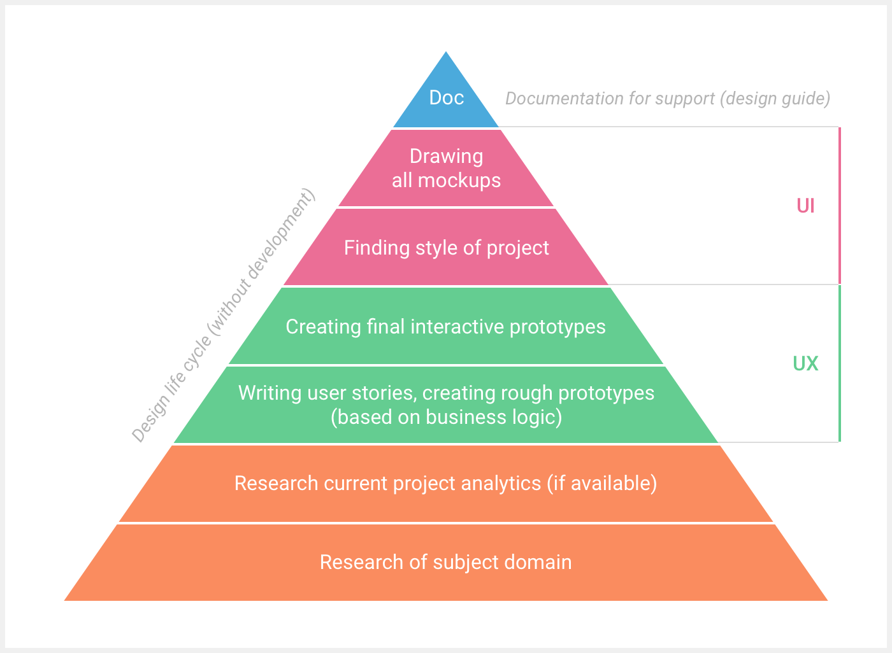
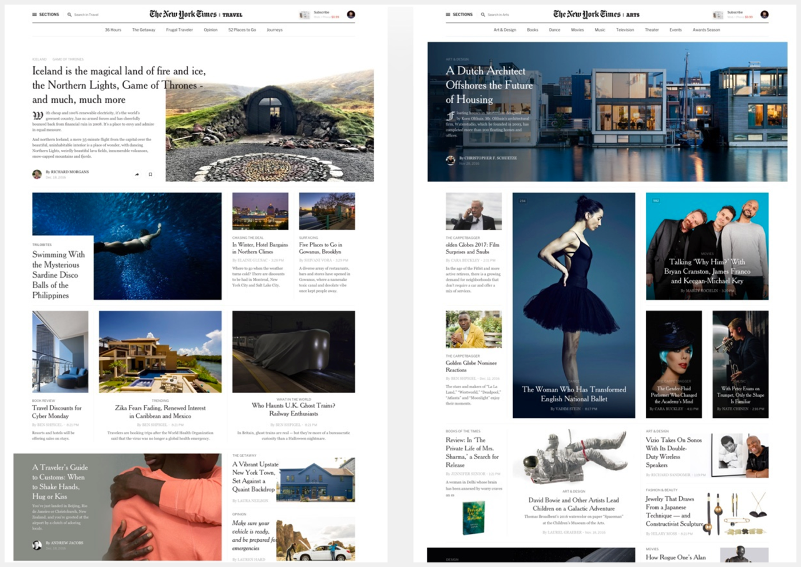
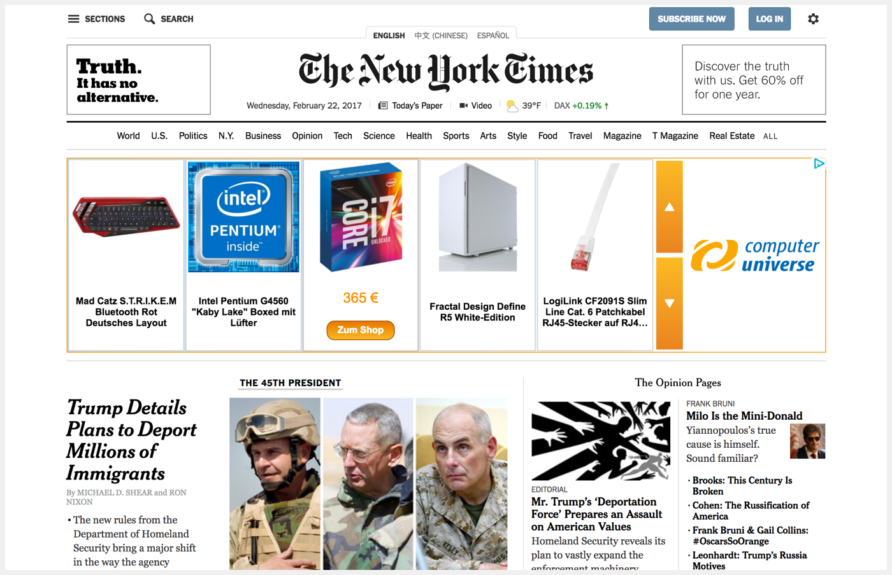
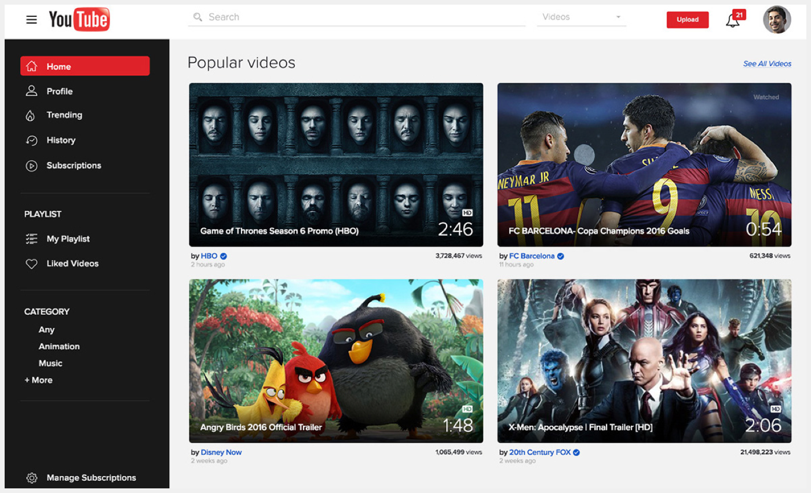
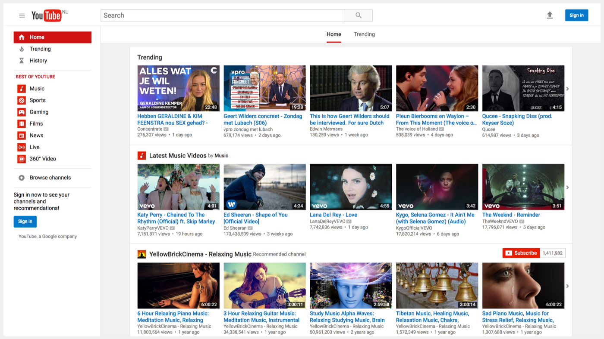
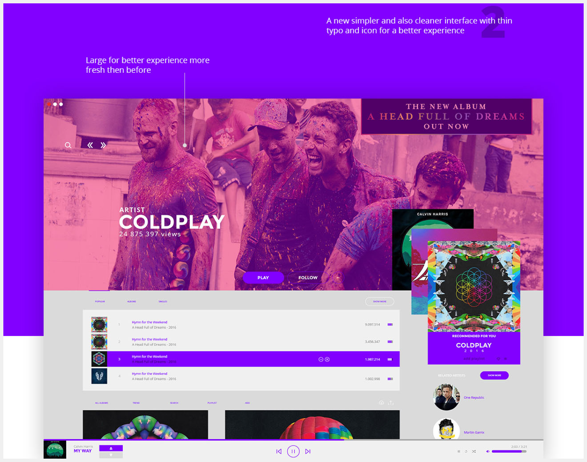
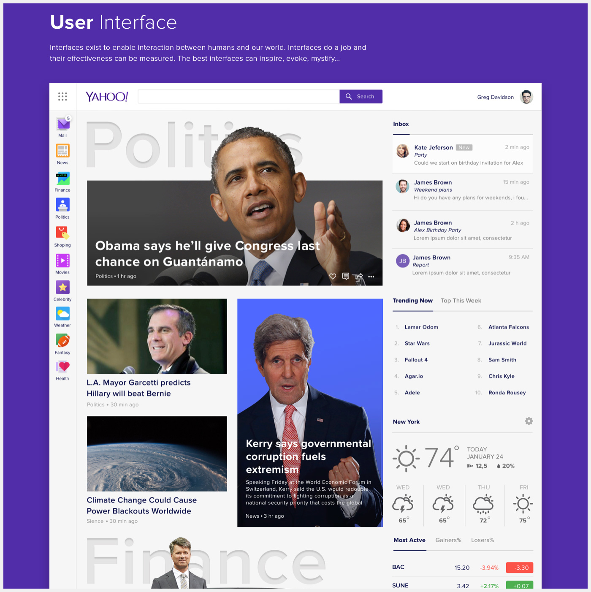
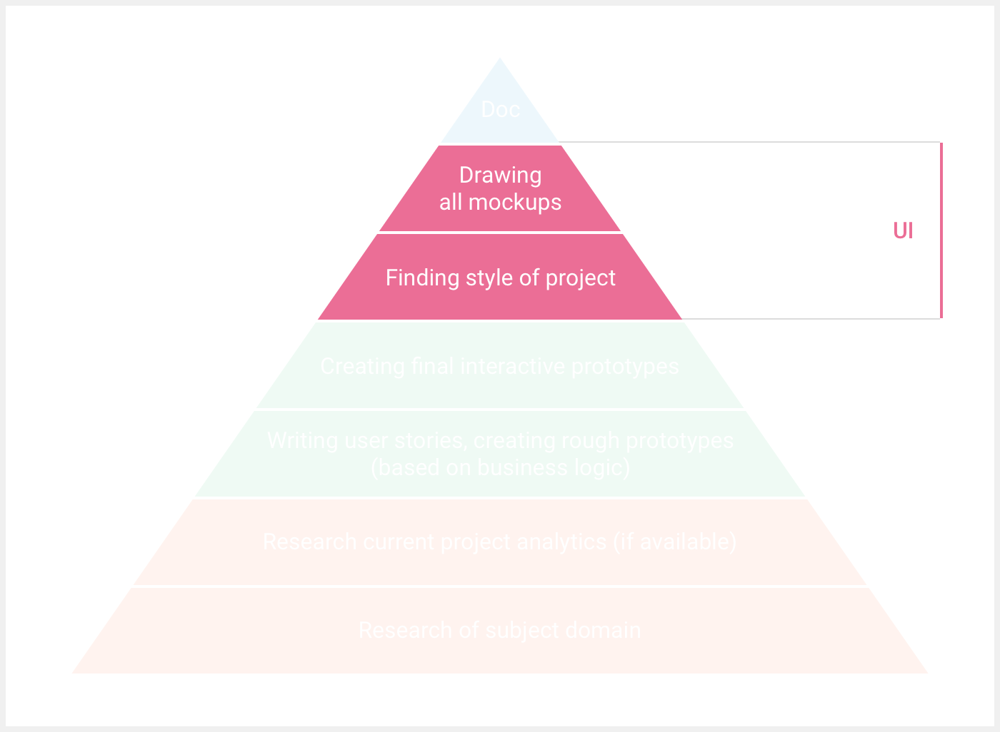

Fact: right now, the profession of UI/UX design is one of the most trendy and expensive in IT. Many people seek highly paid work in this sphere, but don’t have the necessary foundational experience — only a strong portfolio. This is why it is often difficult to determine whether a candidate is an expert, or just someone with beautiful pictures.

In this article, I want to touch upon the following subjects:

- Who a designer is in the production process
- UI and UX: fundamental distinctions
- Why you shouldn’t abuse design concepts for the sake of promoting your portfolio
- What kinds of projects would best for early career designers to invest effort and time into
- Which qualities are most useful for the beginner interface designer to develop

## A designer is first an engineer

It is important to understand that design is, first of all, an engineering profession. Take, for example, the automobile design industry. Before drawing a car, the designer carries out deep analysis: the income of the future owner, in what area the car will be operated, features of the sales regions, etc. This is a design process that begins with research, not with a canvas. Besides research activity, the car designer must understand aerodynamics, the physics of the car, and the general design of its internal components — in short, the technical side.

We can observe a similar process in other areas that require design, including IT. Research into subject domain comprises the root of any project: designers must study the audience of a product, analytical data, the scope of application, etc. Only after the research has ended can the process of prototyping and drawing begin. The designer must also understand the minimum work principles of a program part (it has to work correctly with the main components).

## UI/UX designer: Responsibility and scope

Titles of the majority of job vacancies feature the combined UI/UX, but not all beginners understand the basic distinction between these concepts.

**UX** (user experience) — this area deals with business logic, user stories, and prototypes of the future product. The result of the UX step is a simple and clear interface with the most important user needs.

**UI** (user interface) — the visual components of a product. UI begins after approval of the prototyping step. It is a search for the product’s visual style, and draws up all pages in the developed guidelines.

These two terms cover a complete cycle of work on product design, from research and prototype creation to the final drawing of all project pages. There is considerable professional value in honing both skill sets. A UI/UX designer is an engineer with a developed appreciation for aesthetics. Usually, companies look for people who meet these requirements, as the need to hire two people thereby disappears. I also strongly believe that UI without UX is almost deprived of sense. A beautiful picture won’t solve problems of convenience and simplicity.

Let’s sum up the unit. The responsibilities of a UI/UX designer are:

- Research the subject domain
- Work with analytical data (Google analytics)
- Write user stories; develop and test product prototypes (UX)
- Draw mockups according to the developed guidelines (UI)
- Create design guides for future project support

## Don’t abuse concepts

If you watch trends in the world of web design on such portals as Dribbble and Behance, you have most likely noticed how many people offer their personal visions of large websites and media products. On one hand, it is a useful experience to take another look at large websites that often don’t change their appearance for years. On the other hand, this requires a lot of time and effort from the designer.

I am skeptical about such works for the following reasons:

- **Lack of analytics**. As I wrote above, design is a marriage of subject domain research and current website analytics. Designers who offer new visions of YouTube or any other large website do not have this information. Therefore, the usefulness of such work is reduced almost to zero. It is important to understand that a website must not only look beautiful, but also perform its main functions (captivate users, bring in income, etc.). Generally, such purposes aren’t considered in concept designs.

<!-- _NYT redesign concept. Media is funded by advertising, but I don’t see it in this design. [project](http://bit.ly/2mlQoQG)_ -->

- **Lack of testing**. Large websites with audiences in the millions never issue a product without preliminary testing on a user sample. After such tests, there are usually completions and adjustments. Only after several iterations is the new design released to the masses.

<!-- _Okay, looks good. But why do I see only four videos on the full pageview? [project](http://bit.ly/2mlRtrM)_ -->

- **Violation of brand guidelines**. I have noticed that beginner designers often show their personal vision of a product, changing practically everything about it and rendering it unrecognizable at first glance. In such concepts, brand identification is lost. In my opinion, this is the biggest mistake a designer can make. We are used to Skype being blue, YouTube being red, and Spotify being green. In fact, every brand has a recognizable company color and style that remains from version to version. It is silly and shortsighted to change this, even in a concept.

<!-- _Purple Skype design. Brand identification is lost [project](http://bit.ly/2mm9MwH)_ -->

<!-- _Purple Spotify design. I don’t know why this color decision was made. Just for novelty? [project](http://bit.ly/2mlQbg3)_ -->

- **Complexity of support**. Often, when creating a concept, the designer thinks only about the beautiful picture, losing sight of such important factors as accessibility and future product support. For example, in the media sphere, it is important that editors can put out articles quickly after having prepared all the necessary materials. Concepts often lose sight of such nuances.

<!-- _Some may think this design looks good, but I find it hard to support. It requires too much time to process the picture and make a selection. [project](http://bit.ly/2mm155F)_ -->

I believe that designers who invest time and effort into creating such concepts generally do so for the sake of publicity around the work. New concepts of large websites will draw media exposure easily, and lead to many likes and follows. But from a practical point of view, they will be useless. And, in such works, the essence of the UI/UX design profession is washed away. In place of reasonable decisions, there are only nice pictures.

I don’t want to say that all concepts and redesigns are useless, or even bad. On the contrary: works in which designers explain their point of view on the basis of research are sometimes successful. Such work is not based on analytics, but logical reasoning is behind it. In my opinion, this is the correct approach, since the author is imitating the process of designing a real product (analysis, prototype, drawing). But in the majority of these works, I observe only pictures without reasoning. I am skeptical about such designers.

## Where to invest time as a beginner UI/UX designer

The barrier to entry in the sphere of UI/UX design quite low, but in my opinion, it is very difficult to find a true expert. The availability of information allows many to draw concepts with ease, share works with other people, and even win their first orders. But in such conditions, designers develop as specialists extremely slowly. It is important to understand the basic principles of product creation from scratch. Therefore, I advise new designers to use any opportunity to work on real-life projects, even without big and famous names. For example, you can intern at a large studio. As a rule, in such companies there are many tasks that are just right for an early career specialist. It is important to get work experience within a complete cycle of product creation.

## What skills are necessary for UI/UX designers to develop

In my opinion, it is extremely useful for designers to develop the following skills at the beginning of their careers:

- Logic. Try to build logical chains to explain your point of view and how you make decisions. Logic is important for everything, even in your everyday life.
- Variability. Always propose several solutions for the task set for you. It is extremely useful to look at the existing problem from different angles.
- Analysis. Learn to analyze not only figures, but also more general information about a product and subject domain. Expand the framework of the task set for you.
- Sense of style. It isn’t necessary to be an artist or draw well to do fine work in web design. Sense of style develops over time; the main thing to do now is to find and analyze high quality works by other designers. Prioritize already existing projects, not concepts.

When you spend your time drawing concepts, at most, you will be able to develop a sense of style. This is only the tip of the iceberg in the UI/UX design sphere.

## Conclusion

I consider it extremely important for beginner UI/UX designers to learn how to use their time wisely, giving preference to work on real-world projects. Only this practical experience will give you the chance to become a true professional in the area. Give due attention to each stage of the creation of a product — not just the beautiful picture — and you will gain not only public recognition, but also an expert perspective to offer a famous company.
