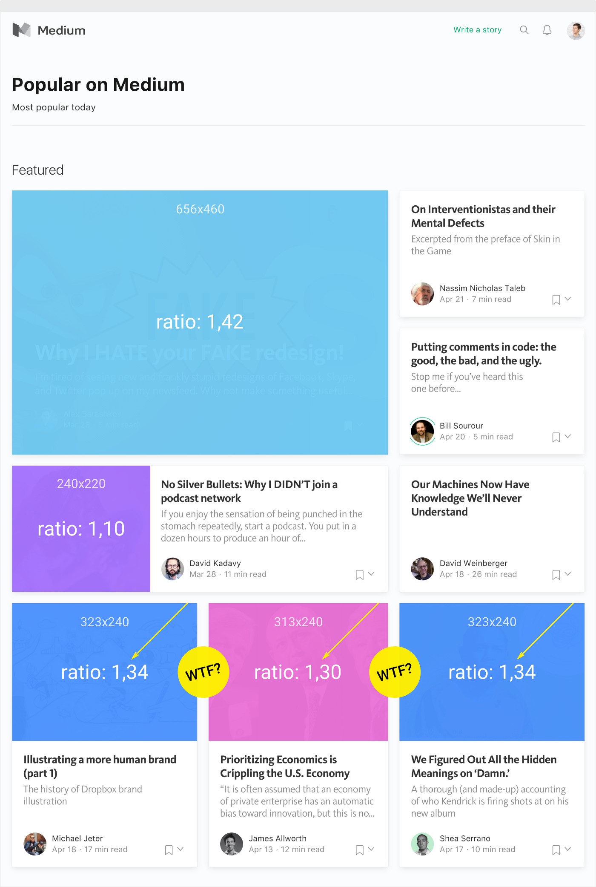
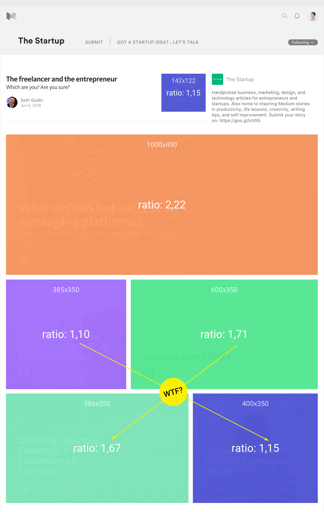
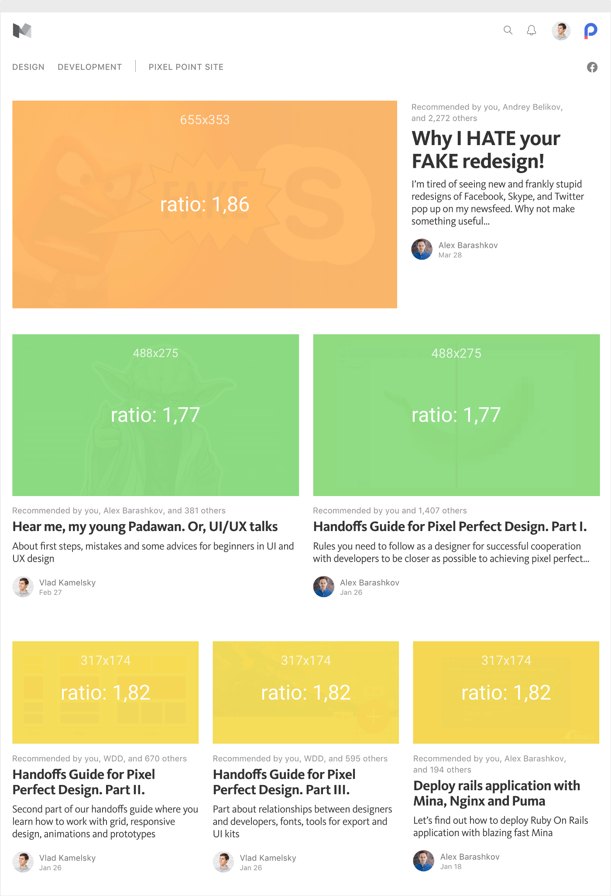
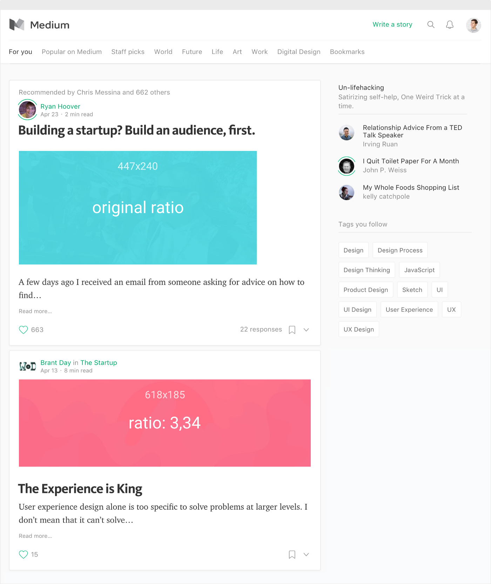
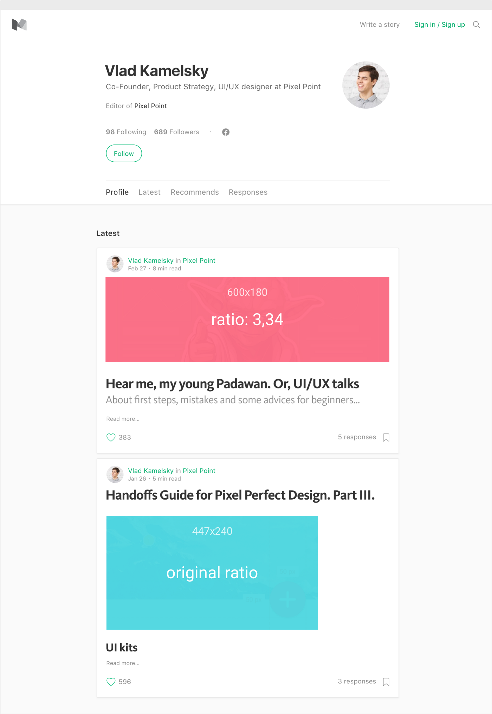
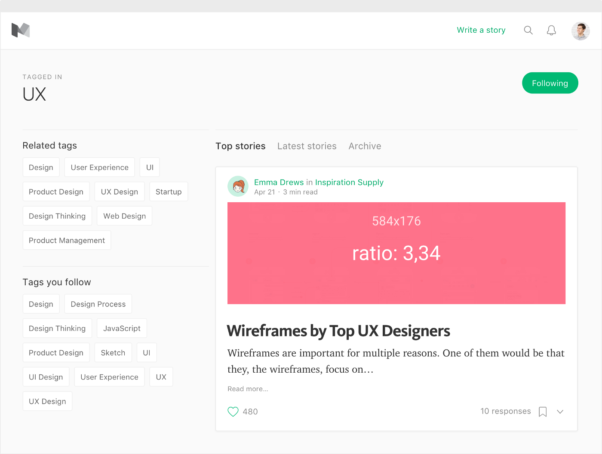
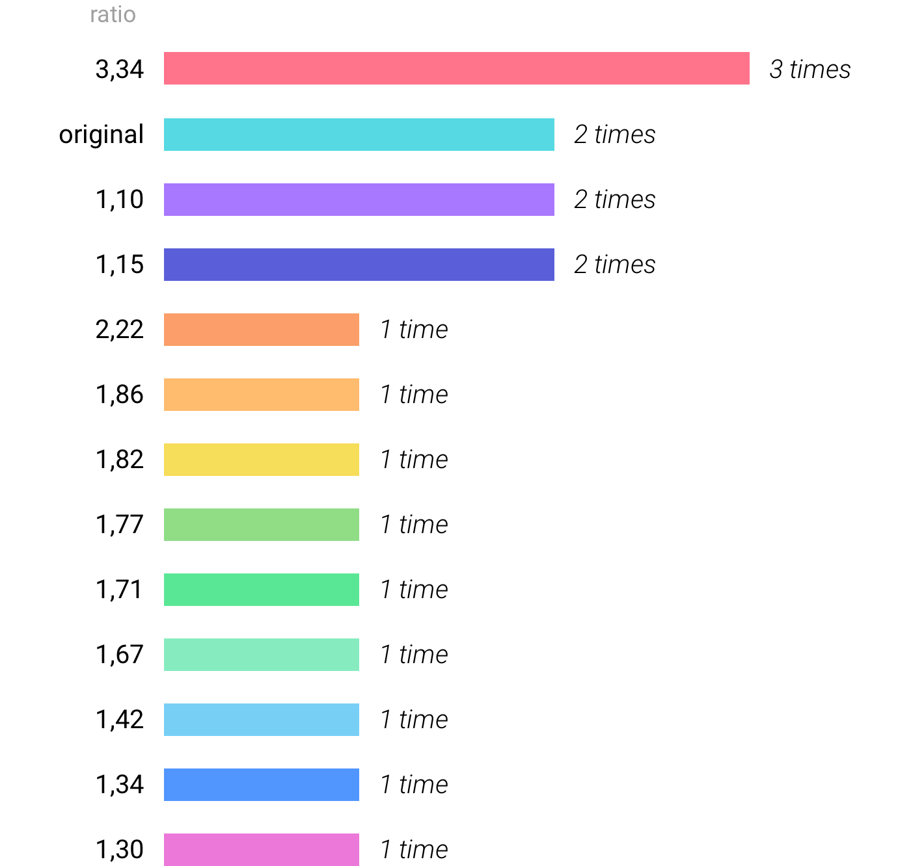
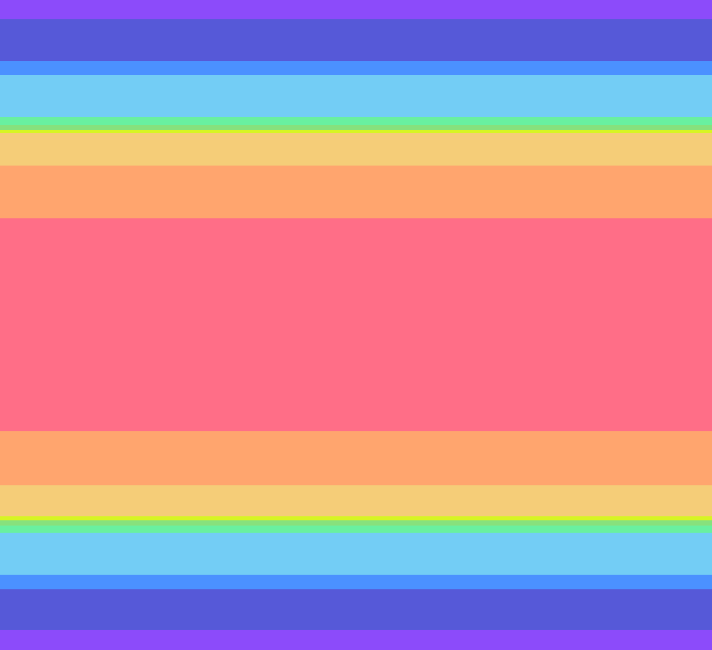
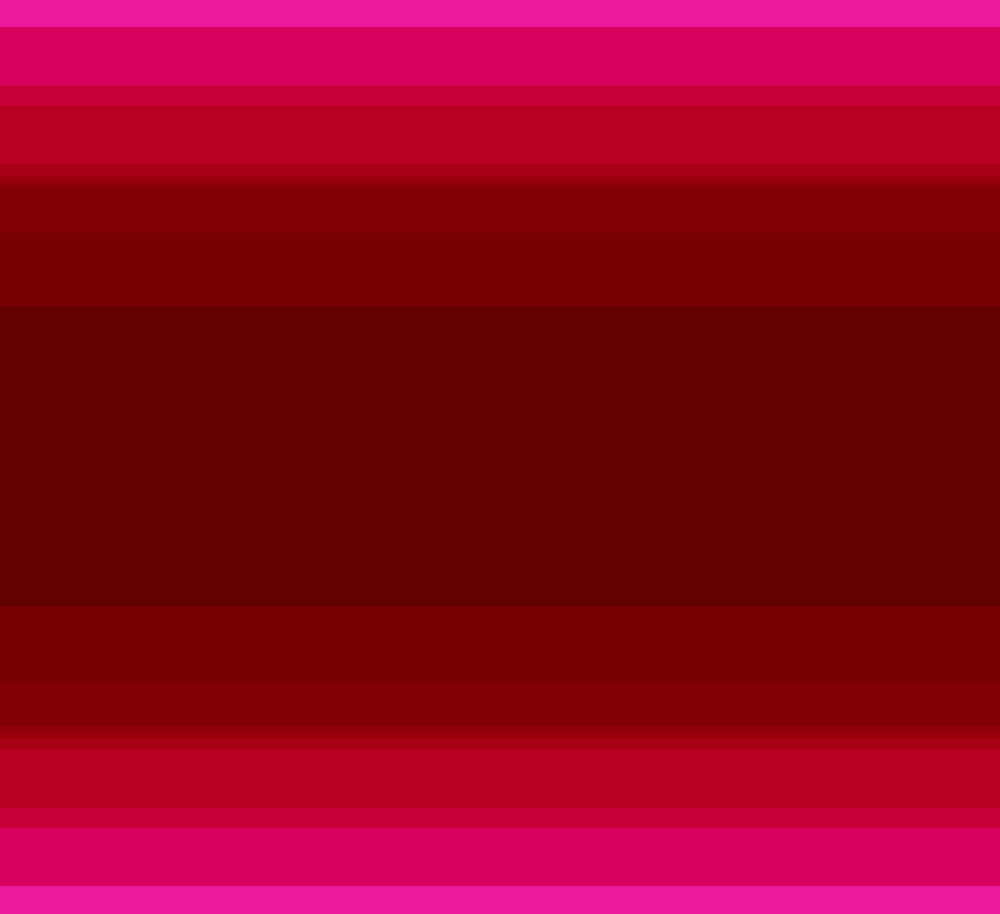
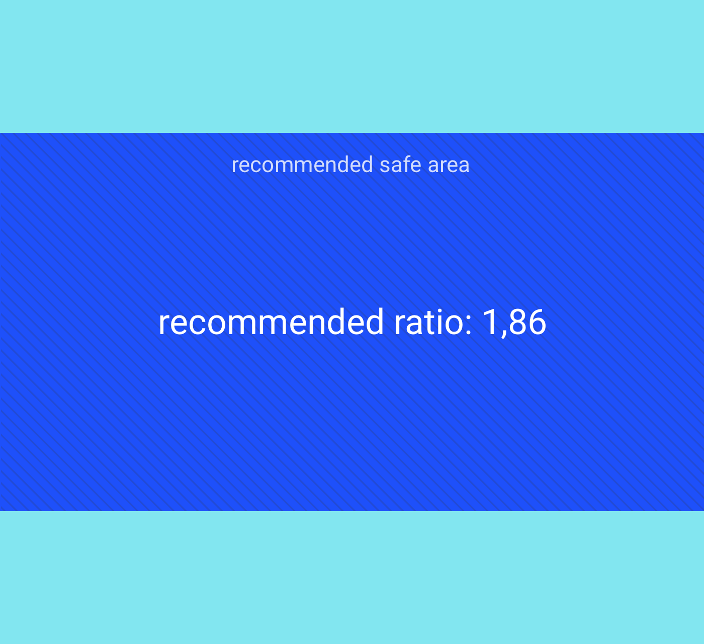

When we first created covers for our Medium articles, we noticed that on different pages, they are cropped with a lot of different aspect ratios.

I wanted to understand what aspect ratio I needed to use for design covers, so I looked practically everywhere I could think of. As I didn’t find guides about creating covers for Medium, I decided to dig into the research around formats and write one here. The results have very much surprised me.

Firstly, Medium has a flexible grid. This is why I did my research at one resolution, 1440x900, which is for a desktop. In the range between 1024 and 1920, all previews are static and don’t change proportions.

At the end of this article, I will give a few thoughts about creating covers.

## Review proportions of covers and grid

You may have noticed that even within one page, the aspect ratio of covers varies. It looks especially strange on the lower row. Perhaps it has been created so that you do not use sizes at 33.3%, but since Medium has a flexible grid, float values meet across in other places.

Look how similar blocks have slightly different cover proportions. From my perspective, it seems like an odd choice. It’s possible that it’s just a realization bug, though.

On some pages, the post previews use images with the initial ratio. The truth is that this only happens when the first picture in the post isn’t stretched to 100% on page width or haven’t large size. This was likely a pragmatic choice.

Below, I have included three nearly identical blocks that are found in different sections. They have identical aspect ratios, but the sizes of the pictures different.

## Results

In these pictures, you can see the concrete ratio on different pages and how often these meet:

These results, in my opinion, are unexpected. I am sure that the situation will change, but at the moment, it doesn’t work — especially for those who worry a little too much about creating covers for posts. My results also showed that, at the moment, Medium’s grid has no specific rules of conduct.

## Recommendations for creating covers

First, I want to visually demonstrate the dispersion of various proportions:

In the picture below, dark sites correspond to zones, which will always be visible on any type of cover. The darkest zone will be an absolute safe area.

My recommendation is to use a ratio of the parties, as in the picture below. I call it the “golden mean.” You can download it at the [link](https://drive.google.com/file/d/0B93jtUDUrZxiekxHakxwOGZOS2s/view?usp=sharing).

I want to note that I didn’t consider a Publications page with dynamic grids, because their covers behave absolutely on a miscellaneous at any resolutions.
