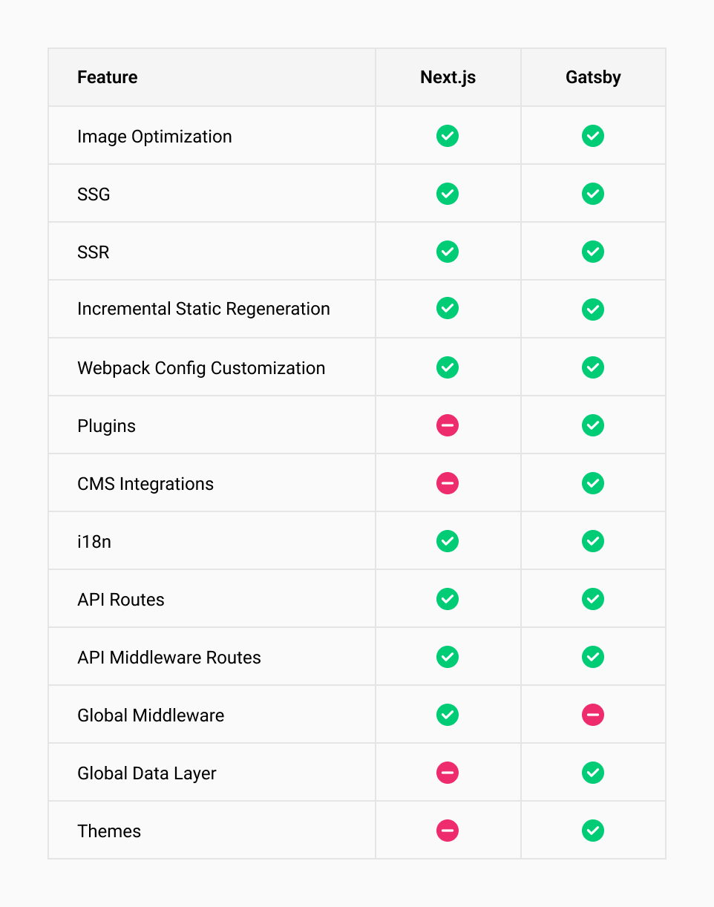
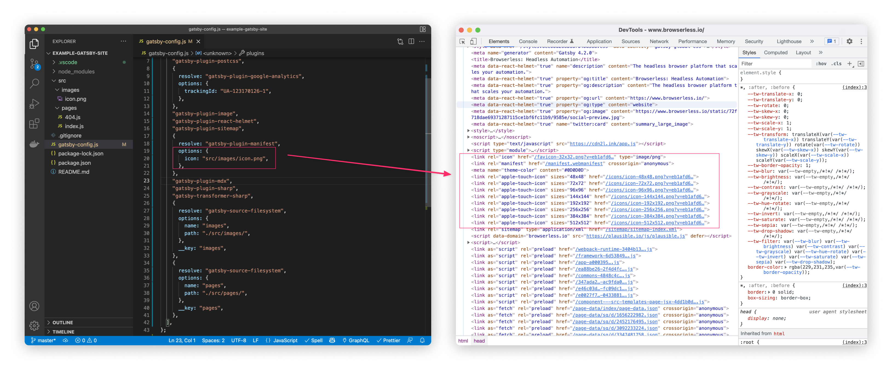
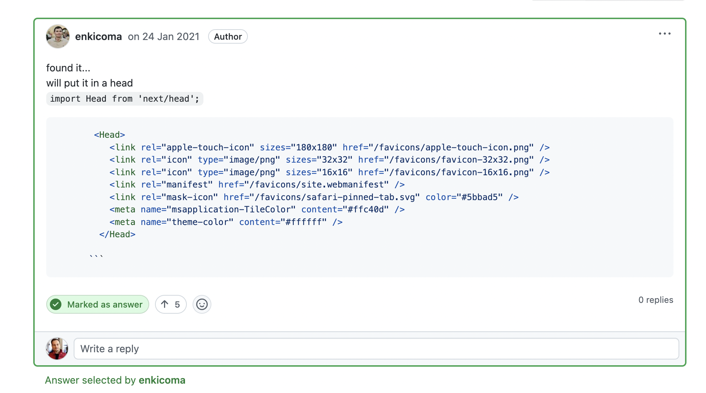
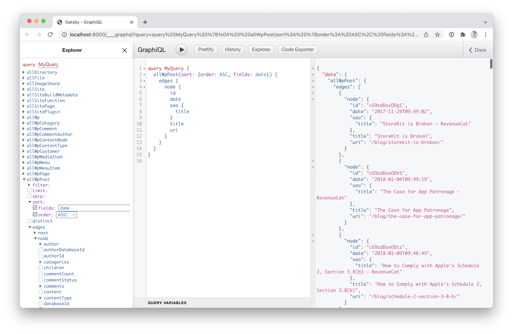
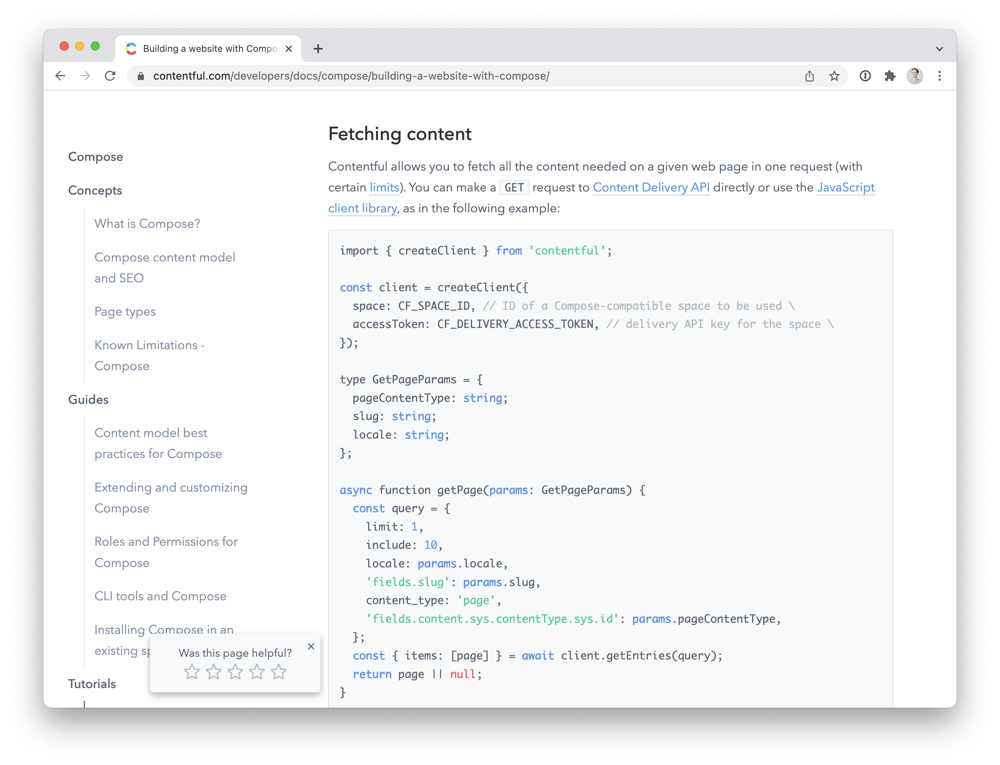
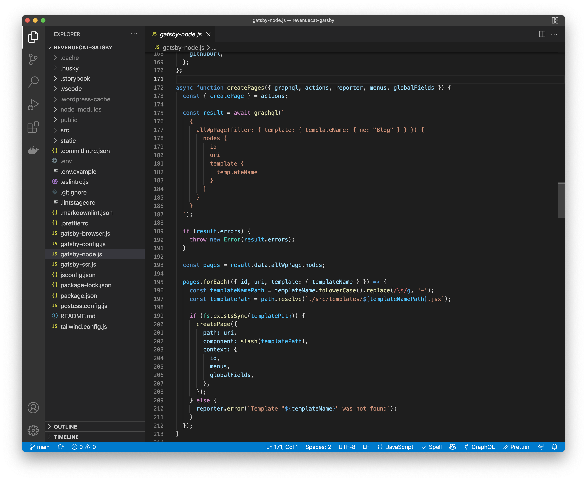
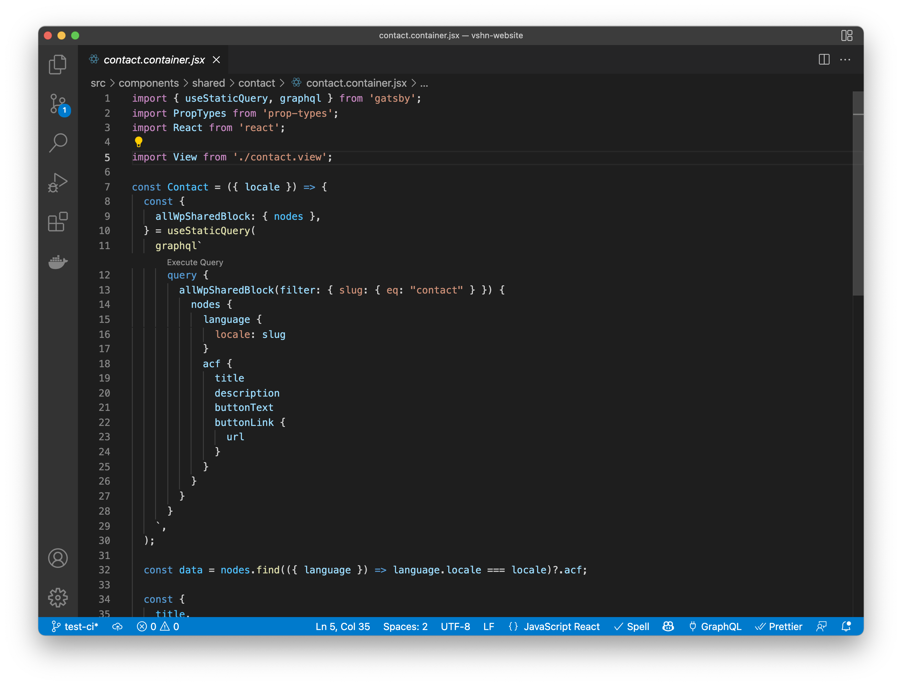
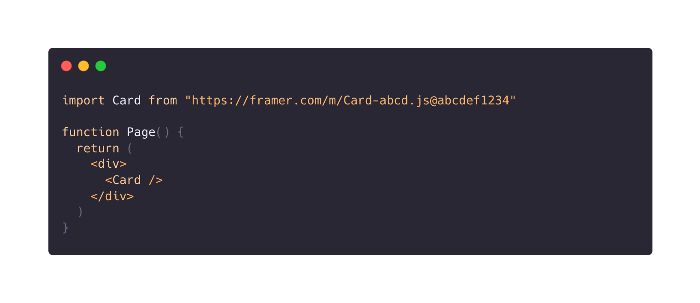

Gatsby and Next.js, from a first glance, could look pretty much the same. Both are React-based frameworks, do SSR, SSG, have big communities. We actively use both technologies in [our agency](https://pixelpoint.io/), but we think that they fit better for different use cases. I often get asked why we use Gatsby instead of Next.js for websites development? This article will explain it in detail.

Choosing the technology for website development, we need to keep in mind a few factors

- Speed of development
- Editorial experience
- Maintainability
- Scalability
- Customization

Here is how a feature comparison table between two frameworks might look like. They are pretty much the same, aren’t they?

However, those minor differences could cause a huge impact on website development.

Now, let’s go over what needs to be on a website and check how the frameworks handle the same tasks.

## Everything begins or ends with Favicon

A simple, tiny thing that every website has. But, in order to be compliant with different use cases, OS, Browsers, you need to have usually more than one - 16x16, 32x32, 180x180, 512x512, etc. It’s nice when you don’t need to care about it

### ...and with Gatsby, you don’t

Change a single line in gatsby-config.js and upload png/jpg/svg based favicon...That’s it. Gatsby will generate a set of relevant icons following best practices optimizing the image without any additional work.

### ...but what about Next.js?

There is no opinionated way that Next.js recommends for this. [Try to Google it](https://www.google.com/search?q=next+js+favicon&rlz=1C5CHFA_enFR972FR972&oq=nextjs+favicon&aqs=chrome.1.69i57j0i10i67j0i10i512l2j0i10i22i30l3.4091j0j7&sourceid=chrome&ie=UTF-8) and see how different the answers are, e.g., this [Stackoverflow Thread](https://stackoverflow.com/questions/56213019/how-to-add-a-favicon-to-a-next-js-static-site). Everything has to be done manually - image optimization, image resizing, embedding the proper tags using `<Head>` tag. As an option, you can use favicons generators services like [this](https://realfavicongenerator.net/).

## Future is here with image optimization

Both do a lot of magic, tuning images with the sharp library, bringing the support for modern image file formats such as webp and avif, which results in smaller files’ sizes and a faster website loading speed.

Both have their own image components, `next-image`, and `gatsby-image`, with a similar API. But there are a few differences.

### Is next-image good?

`next-image` is just a component when the actual image optimization happens via API route that accepts query string parameters and returns a processed image, e.g., `/\_next/image?url=http://example.com/avatar.png&w=32&h=32`

I like this architecture for it also brings additional flexibility in terms of using optimized images without using a react component.

Another thing worth mentioning: `next-image` requires you to specify the width/height of the image, which is not the case when you fetch data from a CMS unless you use `layout="fill"`, but having done that, you are required to manually handle the logic of the image wrapper. So to avoid layout shifts, you fetch the image from a CMS, get their width and height, then, for example, use a CSS aspect-ratio property or go with the SVG hack as `gatsby-image` does automatically to maintain the original proportions

### or gatsby-image is better?

`gatsby-image` does not have that API endpoint and does the magic behind the scene using the power of their graphql data layer and different transformer plugins. Everything works out of the box without additional configuration. But there is one more thing that Gatsby can do better - [image art direction](https://www.gatsbyjs.com/docs/reference/built-in-components/gatsby-plugin-image/#withartdirection). Art direction aims to define multiple image srcsets for different screen sizes that could be cropped and positioned differently. The typical use case for this is when you have a big diagram, let’s say on the home page, but on mobile, it will be too small if we just scale it down. As a solution, you might pass a secondary image with increased diagram labels to the srcset optimized for mobile devices.

## Importance of CMS Integrations

For the best customer experience, it’s precious to provide the greatest flexibility for editors and solid CMS integration in place. On the websites, we build every word and page can be edited via CMS and any additional metadata - page URL, meta tags, og tags, etc. We use Headless WP most of the time, but sometimes do the job with Contentful, Strapi or Prismic, so having a flexible and straightforward way for data fetching from different platforms is crucial.

### Gatsby and the power of plugins

With Gatsby, the integration is a matter of plugin installation and providing API keys. No need to deal with SDKs and nerding through API docs. Everything will be fetched and added to a unified Gatsby Graphql Layer. There are so many plugins that you can find a source plugin literally for anything. The client uses some recruiting platform and wants to display a jobs list on his own website as well? Not a problem. Does he plan to display a list of Github repositories with stars counter - just go and grab the plugin for this. Data will be added to Graphql, and you wouldn’t need to worry about the learning curve for understanding various APIs.

### Next.js tailored approach

Next.js does not have a plugins ecosystem, so for fetching data from a CMS, we have to find SDK, learn an API, think about the reusability of that integration within the website on different pages, probably make some SDK wrappers for common use cases, or HOC. Maybe it’s ok for small sites, but for large ones it will require spending some time thinking about the overall data fetching architecture and scalability of the solution.

## To preview or not to preview?

Okay, let’s step back here because I’m sure that many people don’t even bother themselves giving that functionality to the editors. Previews functionality means rendering a specific page on demand from a CMS without publishing it in the production.

If you use Gatsby, it supports the most popular CMSs, and it works seamlessly. You can either use Gatsby Cloud, and the preview server will be created automatically, and all you will have to do is just point CMS to a correct URL, or you can deploy a self-hosted version running gatsby with `GATSBY_ENABLE_REFRESH_ENDPOINT=true`. Below is an example of how it works with Gatsby + Headless WP.

<video src="https://pixel-point-website.s3.amazonaws.com/posts/2022-02-22-comparing-gatsby-and-nextjs-for-website-development/video.mp4" width="640" height="444" controls muted></video>

With Next.js, things yet again get more complicated; [see the official doc](https://nextjs.org/docs/advanced-features/preview-mode). Again, there is a need to write it manually for every entity you plan to preview, defining rules of how the data from a preview trigger will be parsed, what will be fetched later, and what will be rendered. Instead of a five-minute setup with Gatsby, you will have to spend hours to get something usable.

## Flexibility for editors with programmatic page generation

### Next.js options

To achieve the best-in-class editor experience, editors have to be in charge of defining URLs and pages displayed on it. Let’s break a rule and start from Next.js first. There are few options to achieve or partially achieve it.

1. Hardcode dynamic subpages URLs eg. `pages/post/[slug].js`. For example, there is a slug field for a post on the CMS side, and you agree it will always be under the `/post`, then define [getStaticPaths](https://nextjs.org/docs/basic-features/data-fetching/get-static-paths) in the component.

2. Write a wildcard component in the root `pages/[...path].js`. Then write an additional wrapper component with the logic of mapping a specific URL to a specific component. It raises plenty of issues and increases the architecture complexity a lot.

3. Use [Faust](https://faustjs.org/) - a framework built based on Next.js tuned specifically for WP integration. Look at the source code, and you will find that they exactly do option 2) and see how complex it is. And it’s only available for WP.

### Gatsby way

Gatsby originally has been created as a SSG framework, so it has a few powerful architecture concepts

1. Single point of programmatic page generation in `gatsby-node.js`. Imagine that it’s like telling the framework in a natural language - “Please fetch all pages from a CMS, then create for each CMS page a relevant Gatsby page based on a template and make it accessible on a URL defined in a CMS.” So here, we can use different templates for pages based on the data from a CMS.

2. Templates concepts. Separating Pages concept and Templates makes it easier to define hardcoded URLs and programmatically created pages based on templates.

As a result, you can achieve entirely CMS-driven routes and pages creation without overwhelming yourself with complicated logic in the code.

## We demand Incremental Static Regeneration

Incremental Static Regeneration (ISR) allows you to update only specific pages incrementally instead of rebuilding all pages based on the incoming changes. Incremental builds are technically different from ISR, but both are trying to solve the same problem: speeding up content updates on a production by incrementally updating pages. Gatsby has been having incremental builds since v3 and actively uses it with the help of different CMS integrations and Gatsby Cloud by rebuilding only new updates, which usually takes mere seconds.

Next.js had been following a bit different approach that did not require an additional build to run in case of CMS changes. Instead, it allowed you to specify the time in seconds for which the page will be fetched from a cache instead, so it will go and fetch new data when the first unlucky user comes in.

Initially, I was considering putting it as a disadvantage for Next.js. It was a high-demand feature, but while I’ve been working on the article, they introduced on-demand ISR, which is supposed to solve the issue bringing the ability to revalidate cache from external sources calls. [As of the 17th of February, it is considered a Beta feature](https://nextjs.org/blog/next-12-1#on-demand-incremental-static-regeneration-beta).

## Data queries everywhere

Another highly demanding feature of Next.js is query data similar to `getServerSideProps`, `getStaticProps` on a component level instead of just a parent page level. Currently, you have to use props drilling or stores/context to pass data from a top-level to an underneath component. React 18 and Server Side Component should potentially solve this issue in the future.

Meanwhile, in a Gatsby project, you can fetch data from a global graphql layer from anywhere using `useStaticQuery`. It simplifies the architecture and allows you to have reusable components.

## Very external imports

This has been brought by NextJS recently and bear all signs of being a massive advantage in perspective, for combining Low-Code / No-Code solutions with hand-written applications. To understand this feature, it is best to read [this great example](https://www.framer.com/docs/guides/handshake/) of usage between Framer and Next.js. You can build a custom component in a visual editor, maybe also wrap it with some nice animations and then just import it to the project with a single line:

This is mind-blowing and opens a lot of further possibilities. Gatsby does not allow you to do this at this moment. So if it’s something you want to use in your project, Next.js is probably a better option.

## Sitemaps are good everywhere

Both frameworks can handle it by using additional libraries. Gatsby handles it with a plugin and minimal configuration. For Next.js, a [library](https://www.npmjs.com/package/next-sitemap) does the same but requires additional post-build script execution.

## Smartless i18n

Interesting thing about this point that despite the fact that the implementation will look almost the same for both frameworks, another Next.js feature called [Global Middlewares](https://nextjs.org/docs/middleware) makes it much more powerful. It allows you to define a top-level middleware and perform, let’s say, a country detection on an edge network and than either replacing or redirecting user to a statically generated page.

## Summary

We can still recommend both frameworks for website development as very reliable solutions. However, Gatsby definitely works better in terms of static generation and integrations made possible by the plugin ecosystem. For us those features are critical and we see how Gatsby allows us to build websites faster, make them flexible and maintainable. Next.js is a more dynamic-oriented framework, and I would go for it only if I need an additional auth layer on the website or maybe in case when I need that Global Middleware functionality that could help deal with i18n, A/B testing, or Feature Flags. These are definitely nice to have, but usually, they are only required for a huge enterprise-grade tech where you can afford such experiments.
