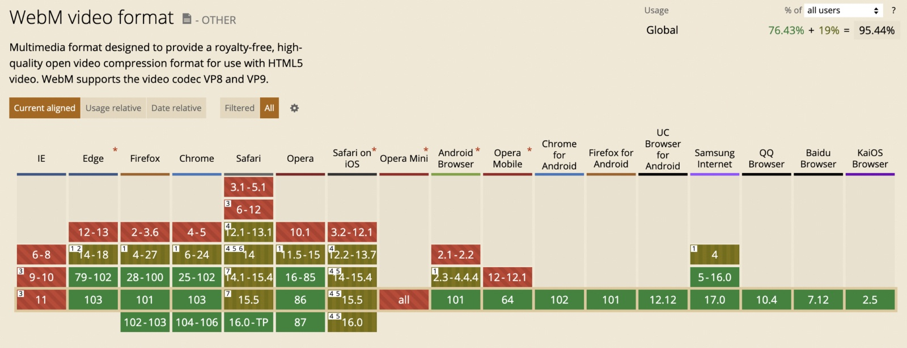

Modern web development every year applies new standards for performance. Frameworks compete by optimizing network requests, images, and code to achieve a blazing-fast loading experience. When it comes to images, almost every framework, headless CMS, or CDN offers built-in optimization options. Unfortunately, the same can't be said about videos.

However, there is still a solution. Modern video codecs can deliver excellent quality while preserving a very reasonable size. Using video for animation with proper optimization is always better than GIF and sometimes outperforms native implementations. In this article, we will learn about codecs like `VP9` and `H265`, and how we can optimize video using `ffmpeg` tool.

### There are formats and there are codecs

This topic can be confusing, so it's important to learn the difference. Think of video format as a container that defines file structure for carrying video and audio streams. Video and audio streams inside these containers are multimedia data encoded with codec. Some popular examples of video formats are `mp4`, `WebM`, or `MKV`. Famous codecs are `H264`, `H265`, and `VP8/9`.

Now that it is clear, the next important thing to learn is that not every codec is suitable for every video format. For `WebM`, it's `VP8` and `VP9`, while in `mp4` could be almost anything.

<video autoplay playsinline muted loop width="800" height="600">
<source type="video/webm" src="https://pixel-point-website.s3.amazonaws.com/posts/2022-06-29-web-optimized-video-ffmpeg/apple.mp4" />
<source type="video/mp4" src="https://pixel-point-website.s3.amazonaws.com/posts/2022-06-29-web-optimized-video-ffmpeg/apple.webm" />
</video>

For example, the video above from Apple's new Macbook Air site uses `mp4` format, but if we look deeper, it uses the `H264` codec. `H264` is very popular but much less optimized than `VP9` or `H265`.

### WebM and VP9

WebM is an open, royalty-free media file format designed for the web. It can carry video streams compressed with the `VP8` or `VP9` video codecs and audio streams compressed with the [Vorbis](https://xiph.org/vorbis/) or [Opus](https://www.opus-codec.org/) audio codecs.

It can save up to 20-50% in size compared with `H264` codecs retaining the same quality level. Every modern browser on desktop and mobile supports it, except Safari on iOS. Apple brought WebM support since macOS Big Sur to Safari on desktops, but to this day failed to make any progress on its mobile version.



Don’t be sad though, there is a solid alternative for iOS users.

### MP4 and H265

H265, a.k.a HEVC (High-Efficiency Video Coding), is a codec supported by Apple and shows the same 20-50% better efficiency than its `H264` older brother. It is not a royalty-free codec - perhaps, that is why the adoption rate is much less than of `WebM`'s.


So, by clever combination of `webm` + `VP9` and `mp4` + `H265` for our videos, we can achieve 94% global coverage.

### Video optimization tools

There are two most popular tools for video optimization - [Handbrake](https://handbrake.fr/) and [ffmpeg](https://ffmpeg.org/). Handbrake has a GUI, and it makes it much easier to use; however, using ffmpeg is a more flexible option in case you want to render videos with alpha(transparent) channels or use hardware acceleration that speeds up compression a lot. Also, I find it much easier to share single ffmpeg commands across the team instead of showing where to click things in Handbrake.

### Installation of ffmpeg

If you’re a macOS user, use brew to install it.

```jsx
brew install ffmpeg
```

For everyone else, you can follow instruction on the [site.](https://ffmpeg.org/download.html)

### Basics of ffmpeg

ffmpeg is a CLI tool and it has a lot of options that is nice to know. You can use ffmpeg as a beginner just by running:

```jsx
ffmpeg -i input.mp4 output.webm
```

The output will be `WebM` encoded with `VP9` with a pretty decent compression out of the box. If you wish to master the tool, you will have to learn how to use flags.

For better visualization, I am going to show you how applying different options to ffmpeg decreases the file size and changes the quality. All tests run using one of the animations we've made for a recent project.

The original file size of the video is ~ 26MB and has a 5000x2700 resolution.

<video autoplay muted loop width="800" height="600">
<source type="video/webm" src="https://pixel-point-website.s3.amazonaws.com/posts/2022-06-29-web-optimized-video-ffmpeg/hero-an-crf32-best-libx265-3840.mp4" />
<source type="video/mp4" src="https://pixel-point-website.s3.amazonaws.com/posts/2022-06-29-web-optimized-video-ffmpeg/hero-crf-40-3840.webm" />
</video>

But after even a basic compression it cuts down to **1MB**. Not bad, but we can do better! 🚀

Few more options are applicable to ffmpeg no matter whether you use `H265` or `VP9`:

`-an` - removes audio track. Even if there is no sound in a file, there could be empty audio track information that will occupy some additional weight, so always use it for muted videos.

`-vf` - the option for passing filters to ffmpeg. The most widespread scenario for this one is scale.

```jsx
ffmpeg -i input.mp4 -vf scale=3840:-2 -an output.webm
```

As I've previously mentioned, the original file resolution is 5000x2700, but we don't use it that big, and we can try to reduce it to the size that is relevant to the page. In our case it is 3840px width. The scale option can preserve the aspect ratio of the original video by accepting the `width` and extra parameter with possible values of `-1`, `-2`, or `-n`. `-2` value guarantees that the resulted output resolution will be even. To know more about this, check out a wonderful demo [here](https://trac.ffmpeg.org/wiki/Scaling).

If we run the command above, it compresses the video down to 542 KB.

### Advanced tuning

Additionally to the previously mentioned arguments, ffmpeg `VP9` and `H265` codecs accept `-crf` flag . It enables constant quality mode, which guarantees a certain perceptual quality level within the entire video by passing a number from 0-63(VP9) and 0-51(H265), where 0 is the best quality and the maximum number is the worst.

Anything from 18-40 could give a very decent quality level. When you omit this option, ffmpeg uses `-crf 32` for `VP9` by default.

```jsx
ffmpeg -i input.mp4 -crf 40 -vf scale=3840:-2 -an output.webm
```

**It results in 314KB.**


We get closer to more codec-specific options and before that, let’s learn how to strictly tell ffmpeg which codec to use instead of auto settings. For this, you can use `-c:v` flag. A few interesting options for us are:

`libvpx-vp9` - which is used be default when you convert to `WebM` using `VP9` codec

`libx265` - for `H265` code and `mp4` container

`hevc_videotoolbox` - for `H265` with a hardware acceleration

Example:

```jsx
ffmpeg -i input.mp4 -c:v libvpx-vp9 -crf 40 -vf scale=3840:-2 -an output.webm
```

**VP9 specifics**

`libvpx-vp9` has the option `-deadline` which accepts following values:

- `good` is the default and recommended for most applications.
- `best` is recommended if you have lots of time and want the best compression efficiency.
- `realtime` is recommended for live / fast encoding.

Using `best` could save extra KB.

```jsx
ffmpeg -i input.mp4 -crf 40 -deadline best -vf scale=3840:-2 -an output.webm
```

**It results in 295KB total size.**

Time to switch to `H265` and `libx265`. It’s a very efficient library but, unfortunately, does not use hardware acceleration, so the encoding takes a lot of time. For `H265`, we need to learn some more extra options.

`-preset` is similar to `deadline` in VP9 but accepts many more values:

- ultrafast
- superfast
- veryfast
- faster
- fast
- medium **(default)**
- slow
- slower
- veryslow
- placebo

`placebo` is the slowest one, but according to official benchmarking leads to minimal encoding improvements. So using `veryslow` is more wise.

Another flag you can pass is `-movflags faststart`. It makes your video web-optimized and results in faster video readiness. We haven't used it in `VP9` `WebM` because its architecture does not require this and always guarantees progressive loading.

And one last thing is `-tag:v hvc1` that makes video work on iOS and macOS devices. So the command looks like this:

```jsx
ffmpeg -i input.mp4 -movflags faststart -c:v libx265 -vf scale=3840:-2 -crf 32 -preset veryslow -tag:v hvc1 -an output.mp4
```

**And it leads us to 260KB!**

You’ve probably noticed that for `H265` we’ve passed `-crf 32` , when for `VP9` it has been `-crf 40`. Both values result in a very similar bitrate for both videos, just a syntax difference due to different accepted number range.

### Pros and cons using `hevc_videotoolbox` library for `H265`

`hevc_videotoolbox` is a macOS-specific library that gives native hardware acceleration for `H265` encoding. It is faster by two orders of magnitude than `libx265`, but has some drawbacks. It is less efficient in terms of optimization and does not have Constant Quality mode (`-crf`) and presets we used in the previous example. As an alternative to `-crf` it’s possible to use `-b:v`, which allows manually defining the bitrate of the video([read more](https://trac.ffmpeg.org/wiki/Encode/H.265)).

```jsx
ffmpeg -i input.mp4 -movflags faststart -c:v hevc_videotoolbox -vf scale=3840:-2 -an -tag:v hvc1 output.mp4
```

**Results in 654KB.**

The one advantage of `hevc_videotoolbox` over `libx265` is that it supports encoding videos in `H265` with alpha channel.

### Sharpening video

For some videos, you can try using the low resolution option, but on retina screens, it could lead to a blurry picture. Try to apply `unsharp` filter the way shown below to improve the perceiving quality while still having low resolution visually:

```jsx
ffmpeg -i input.mp4 -crf 40 -deadline best -vf scale=1920:-2,unsharp=5:5:1.0 -an output.webm -vf
```

For example, `5:5:1.0` will result in medium sharpness; for the light one, try to use `3:3:1.0`, and for the strong one, pass down `9:9:1.0`. You can [read this](http://underpop.online.fr/f/ffmpeg/help/unsharp.htm.gz) doc for more info on this.

Quality perception for dynamic pictures differs severely compared to static images, so hacks like this help your video appear of good quality even in case of further reducing the size of a video.

With sharp


Without sharp


### Alternatives to Constant Quality mode

ffmpeg has more video optimization settings available, such as Constrained Quality, Two-passes, Constant bitrate, and Lossless. But they either increase the encoding time significantly or require more tries to find the best bitrate setting to achieve similar results that you can do with Constant Quality (`crf`) mode.

### Summary

Video optimization for the web with ffmpeg in simple scenarios is pretty straightforward and requires just two commands to run:

**WebM(VP9)**

```jsx
ffmpeg -i input.mp4 -c:v libvpx-vp9 -crf 40 -vf scale=3840:-2 -deadline best -an output.webm
```

**Command flags breakdown:**

- `-c:v libvpx-vp9` define which codec to use
- `-crf 40` define settings for Constant Quality mode
- `-vf scale=3840:-2` define settings for scale filter
- `-deadline best` manipulate the speed/quality ration of upcoming compressing

**MP4(H265)**

```jsx
ffmpeg -i input.mp4 -c:v libx265 -crf 32 -vf scale=3840:-2 -preset veryslow -tag:v hvc1 -movflags faststart -an output.mp4
```

**Command flags breakdown:**

- `-c:v libx265` define which codec to use
- `-crf 32` define settings for Constant Quality mode
- `-vf scale=3840:-2` define settings for scale filter
- `-preset veryslow` manipulate the speed/quality ration of upcoming compressing
- `-tag:v hvc1` make video work on iOS and macOS devices
- `-movflags faststart` make your video web-optimized

> Adjusting `-crf` values could help to find the best suitable option with a minimal size.

And embedding it to the project with this html getting the best possible result.

```jsx
<video>
  <source type="video/webm" src="output.webm" />
  <source type="video/mp4" src="output.mp4" />
</video>
```

As a bonus you can use the following nice shell script below that can create for you optimized video in VP9 and H265 with a single command.

[Use Github Gist](https://gist.github.com/lnikell/7a241aa2fe371170f0fb4a9fb92549ac)
