Text-to-image diffusion models represented significant progress in AI development, so we are eager to apply them in real projects. The synthesized images will impress you with their "artistic" vision and photorealism. However, in our web design field, such images are still more like entertainment. They can become illustrations on a page only in rare particular cases. We want to have a more predictable result and develop a systematic, personalized approach to generate illustrations for the entire site in the same uniform style.

Of course, it is possible to develop an original Prompt template that will generate various images in a predictable style (for example, see [here](https://publicprompts.art/prompts-library/)). This is an interesting long journey in search of the "right" style, but it does not always lead to the desired result. This is because of the limited initial data set on which we train the neural network. In web design, there are many narrow topics, and default models are too general for these nuances. Even the seemingly simple task of selecting the appearance of a button for a landing page reveals the differences in how a web designer and a model see the world.

Instead of developing a Prompt, there is a simpler way to direct AI's wild imagination to a narrow area of a particular graphics task - Fine-tune retraining of the model on a small set of images. You can add a separate object to AI's vocabulary, such as your own face, as in the widely discussed [Lensa](https://apps.apple.com/app/id1436732536) app, or some object, or illustration style - whatever is the most important to us.

## Choosing a Style

You need at least 20 different images to train a model in a particular style.
While searching for a training dataset, I came across the wonderful new MS fluentui emojis. I realized that this is just what I needed! First, we have many images in one style for tests with different dataset sizes. (Thank you MS for making all emojis [publicly available](https://github.com/microsoft/fluentui-emoji)). Second, such a style of 3D icons is modern and universal. We could use it later in as web designers to create new icons, or small illustrations on some topic.

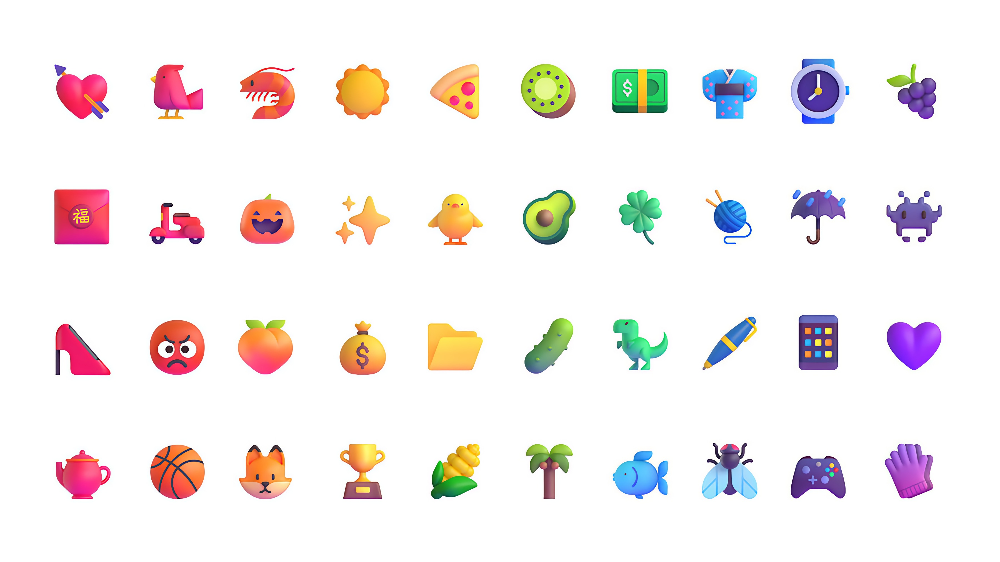

On GitHub, the 3D versions of the icons are uploaded in 256x256 pixels resolution, which is not enough for training, so I additionally upscaled them to 512x512 using SwinIR_4x in AUTOMATIC 1111 web UI.

## Fine-tune

We tried our first Dreambooth fine-tune on a Stable Diffusion model, as it is the simplest and most effective method currently available.

Training requires significant computational resources, specifically a very demanding graphics card and video memory. It also takes a lot of time, from several hours to several days. Therefore, we gave up the option of training it on a local machine after several failed attempts and turned to cloud computing services.

I ran Dreambooth fine-tune using two computational resources: through [Google Colab](https://colab.research.google.com/) and [runpod.io](http://www.runpod.io/) with different settings and dataset size.

I ended up with four models as a result:

**MS_emoji_v1_30img.ckpt** - the first one. A dataset of 30 emojis. (trained on [Google Colab](https://colab.research.google.com/github/TheLastBen/fast-stable-diffusion/blob/main/fast-DreamBooth.ipynb?authuser=1#scrollTo=LC4ukG60fgMy) based on the 4 GB original model sd-v1-4.ckpt) with a dataset of 30 images and 3000 training steps.

**MS_emoji_v2_30img** - the same dataset of 30 emojis and 3000 training steps. I trained the following models on [www.runpod.io](http://www.runpod.io/) (1 x RTX A5000 8 vCPU 29 GB RAM), manually, based on the 7.5 GB original model SD v1-5-pruned.ckpt prepared for retraining [tutorial](https://www.youtube.com/watch?v=tgRiZzwSdXg)). Unlike Colab, runpod has the option to provide a REGULARIZATION IMAGES dataset. I didn't quite understand its purpose; looks like these are images on a specific topic that the neural network already knows (as it has generated them before). But I didn't understand how the NN knows that it already knows them, so I downloaded the default dataset, the prompts are not embedded in PNGs, so I uploaded a dataset of 1000 original MS emojis.

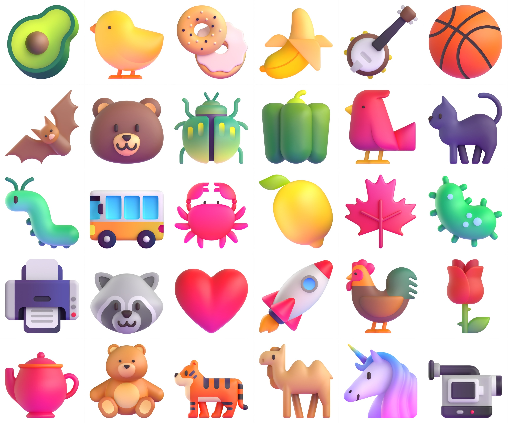

**MS_emoji_v3_50img** is a dataset of 50 emojis different from the first dataset. The model was trained for 5000 steps. All emojis were meant to be scaled up from 256x256 to 512x512 before the training. However, for this model, I accidentally specified the wrong folder and used 256x256 images for training. The model learned to understand that the images should look soapy and compressed =)

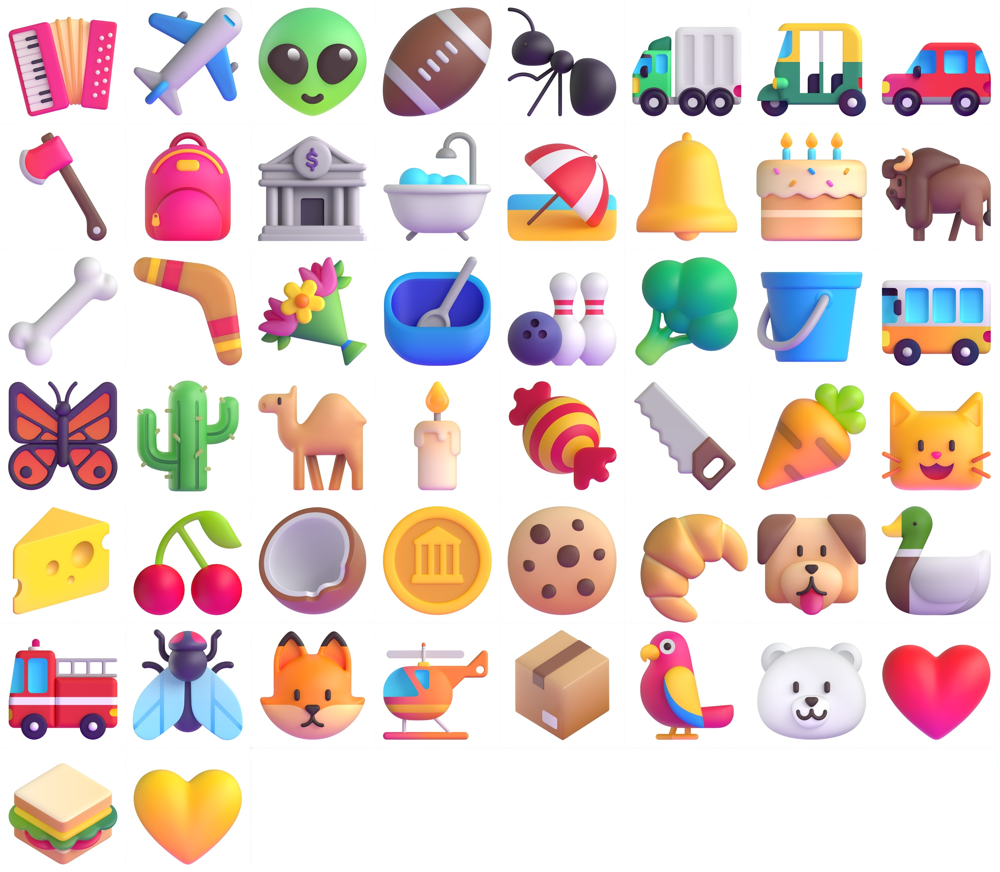

**The MS_emoji_v4_850img** is the largest dataset with 850 emojis. I manually removed overly complex or simple images, as well as all people and faces, so that only objects and animals remained. The model was trained for two days (others were trained for 2-4 hours for comparison).

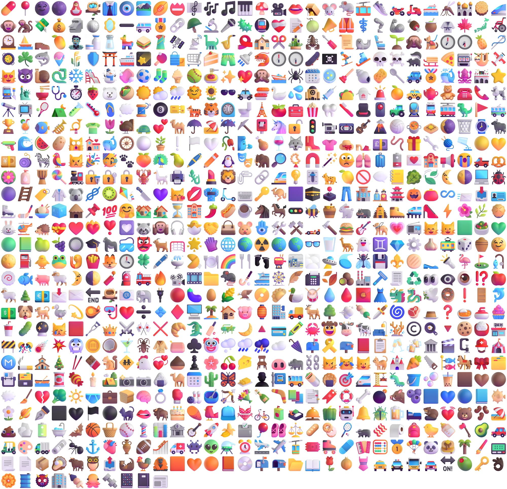

I also slightly changed the REGULARIZATION IMAGES set, adding 370 more simple SD 1.5 generated images to the previous 1000 emojis, which I specifically generated in a similar style. It was never clear if this affected the result.

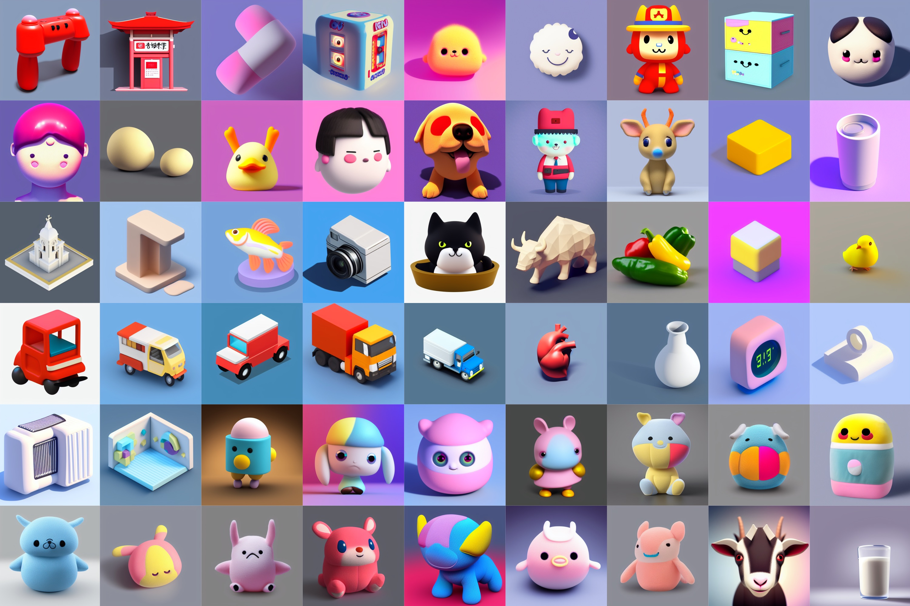

## txt2img testing

I tested how each model generates images with the same seed and prompt inputs.

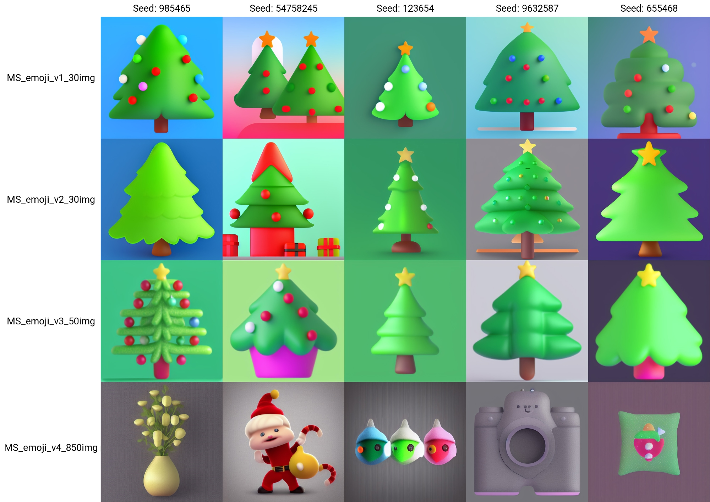

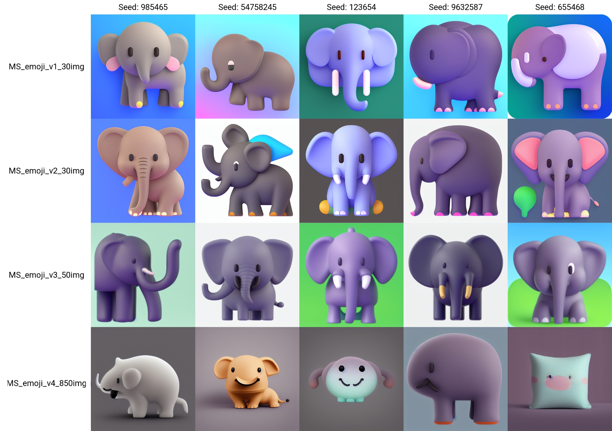

The test results for txt2img showed that models trained on datasets with 30 and 50 images produce the best results. However, the **MS_emoji_v4_850img** model produced abstract results that rarely showed what was asked.

## img2img testing

Stable Diffusion has a great ability to generate images based not only on a text request but also on an image input, which is overlaid with a certain amount of noise (Denoising strength), and then SD tries to restore the image, considering the entered request.

During the testing of MS_emoji models in img2img, I got very interesting results. Namely, with low values of Denoising strength and flat illustrations as input, it is possible to get a close enough image but in 3D!!! With low values of Denoising Strength, Stable Diffusion tries to repeat the original picture as closely as possible, including repeating the color. That's why the characteristic **violet highlights** of MS emoji (which you can notice in the txt2img versions) are lost at low values of DS, but it adds the volume very well.

With high values of Denoising Strength, the models produce interesting variations in shape, and the characteristic violet highlight reappears.

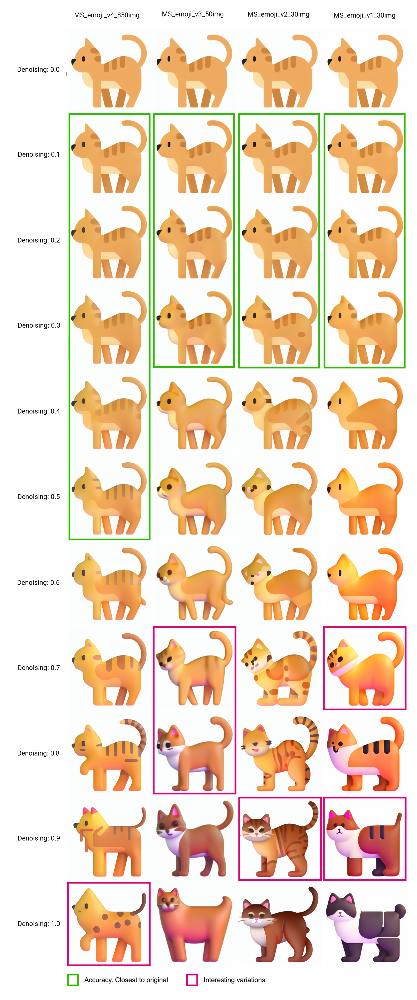

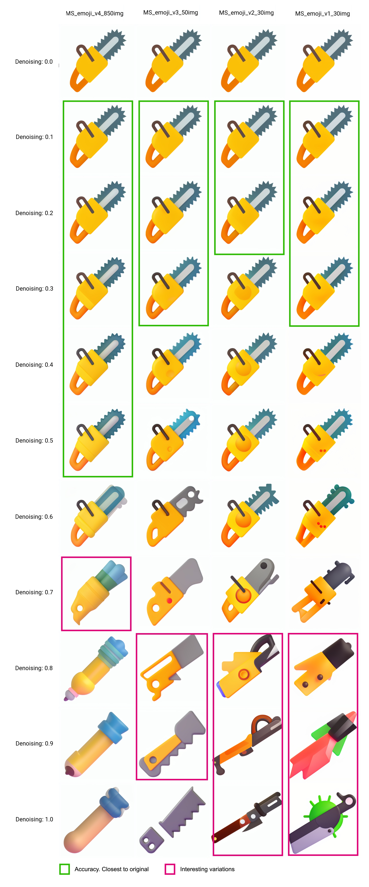

The MS fluentui dataset on GitHub has multiple versions of each image, including 2D and 3D styles. I thought it would be interesting to compare the results of the AI work and the original 3D illustration from MS by inputting the original flat version of the emoji into SD model.

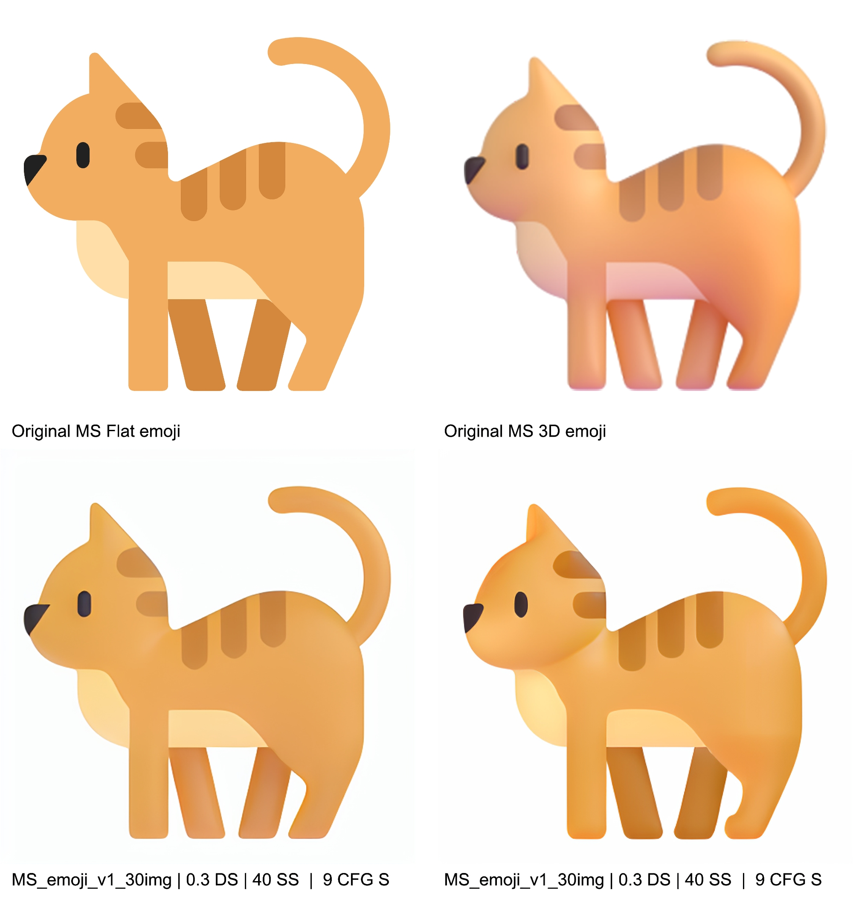
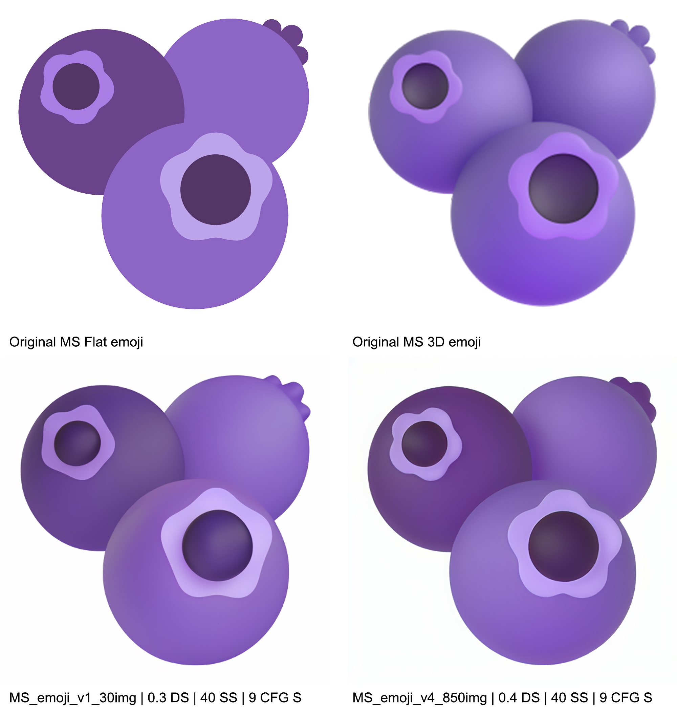

The results are look good and seem quite close to the original 3D images. However, the typical violet highlights of MS emoji are missing. Nevertheless, we have got a universal 2D-3D style converter that does not deviate from the original color palette in the process.

The models work well for converting 2D illustrations with solid fill and no outlines to 3D. The **MS_emoji_v4_850img** model performs the best, preserving details and producing excellent results even with a denoising value of 0.5. The generated 3D images are like the original MS emoji images, although they lack the characteristic violet highlights.

## 100 icons

I was interested in checking the 2D-3D transformations on a larger number of images. I found a [pack of 100 colored 2D icons](https://www.graphicsfuel.com/2015/04/100-free-flat-color-icons/) from [icons8.com](http://icons8.com/) that match the style. And using **Batch img2img** from AUTOMATIC 1111 webui, I processed everything with the previous settings.

The results varied depending on the original image, so I generated 16 versions of each image and manually selected the best options. It would be great to automate this selection process, but I haven't figured out how yet. Also, SD cannot handle the alpha channel, so I had to use some magic program to remove the white background from the images.

Here are the results:

<video autoplay playsinline muted loop width="1920" height="1080">

<source type="video/mp4" src="https://pixel-point-website.s3.amazonaws.com/posts/2022-12-12-ms-fluent-emoji-style-fine-tune-on-stable-diffusion/video-1.mp4" />

<source type="video/webm" src="https://pixel-point-website.s3.amazonaws.com/posts/2022-12-12-ms-fluent-emoji-style-fine-tune-on-stable-diffusion/video-1.webm" />
</video>

Here you can find the result of conversion 100 2d icons to 3d. [Source.](https://pixel-point-website.s3.amazonaws.com/posts/2022-12-12-ms-fluent-emoji-style-fine-tune-on-stable-diffusion/screenshot-14.jpeg)

## Summary

AI can speed up the brainstorming process in our company, but it struggles with specific requests. Training AI for specific use cases can solve this problem. You can download the models we trained for this article on Huggingface for personal testing at this [link](https://huggingface.co/pixel-point/stable-diffusion-microsoft-emoji).

If you enjoyed the article and want to see more web and design tips, [follow us on Twitter](https://twitter.com/alex_barashkov).
