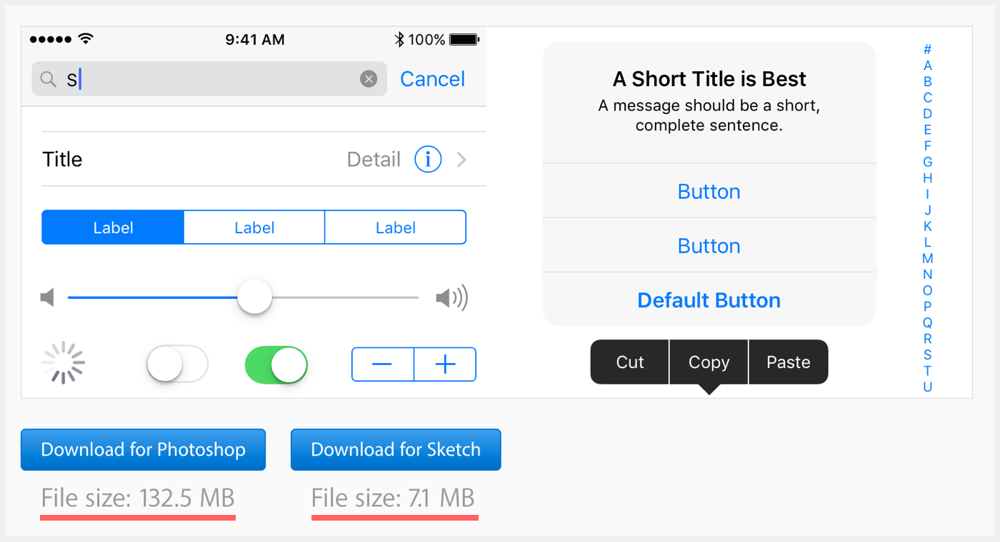
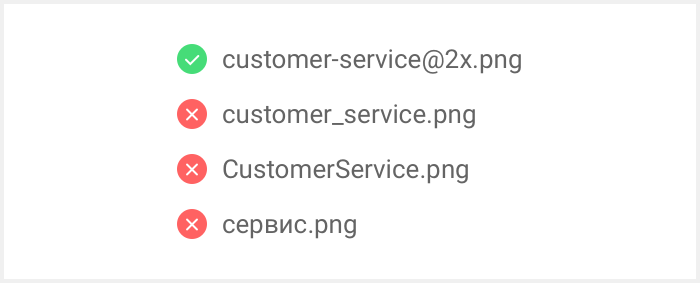
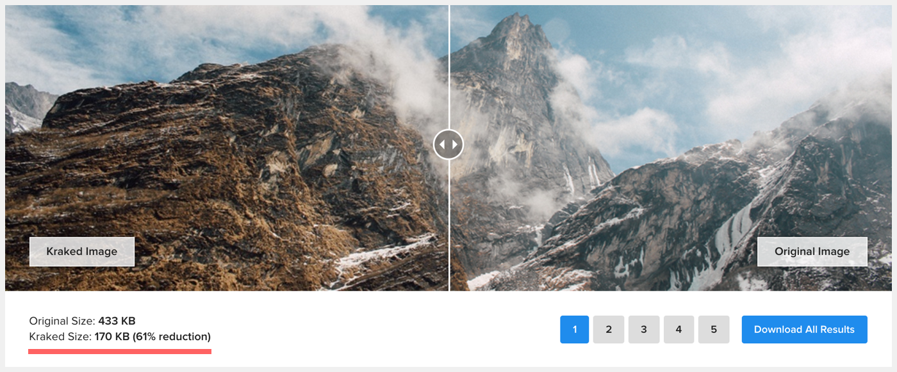
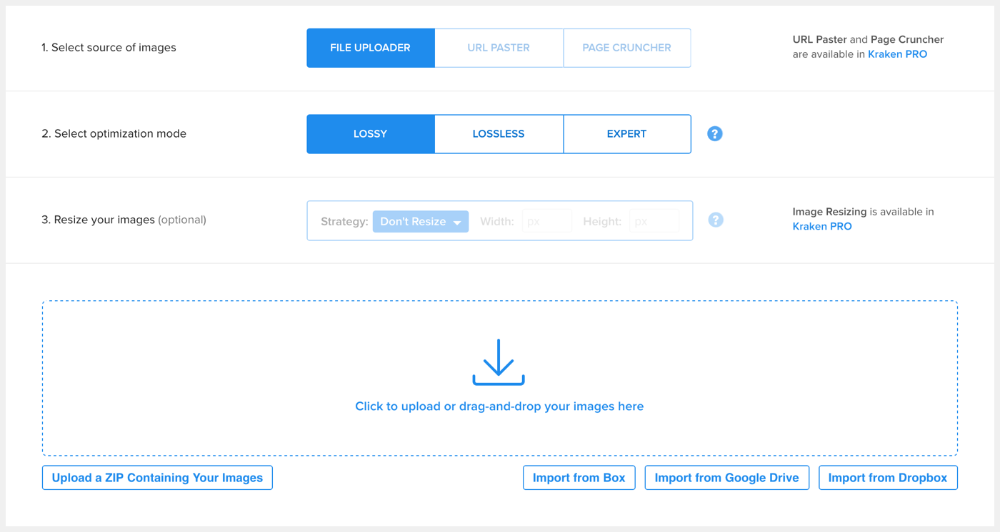
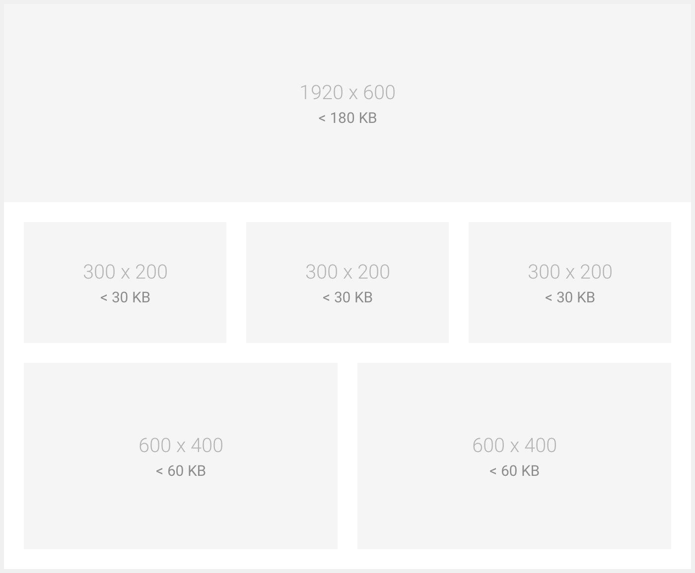
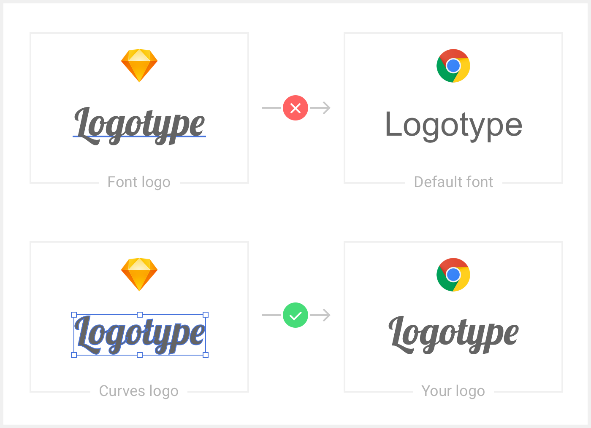
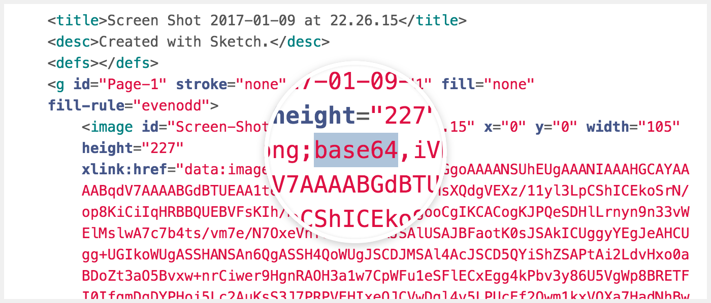
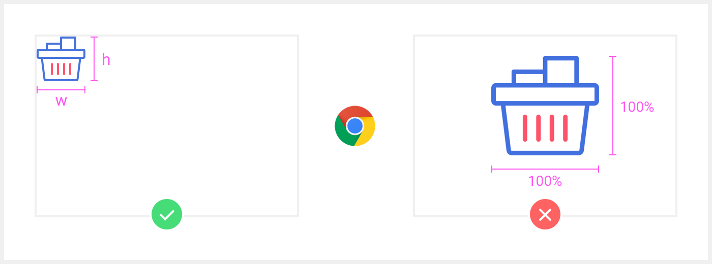

I’ve had the opportunity to collaborate with many UI/UX designers throughout my career, and I’ve noticed one very interesting thing about how they work: They don’t use established guides to complete projects. If you are a new developer at a company, team members can send you links to a GitFlow or GitHubFlow, and you will learn everything you need to know about repository management in 10 minutes. As developers, we can add to a project linters and everyone will follow that code’s style guide. But what can you give your designer to ensure that they deliver everything you want? We at Pixel Point wrote this handoffs guide for just that purpose.

Don’t forget to read other parts too:

[Part 2 — Grid, Responsive design, Animations, Prototypes](/blog/handoffs-guide-for-pixel-perfect-design-part-ii)

[Part 3 — UI kits,Export, Element states, Line-height, Fonts, Developers and designers](/blog/handoffs-guide-for-pixel-perfect-design-part-iii)

## Software

Photoshop has a lot of useful plugins to expedite your work process, but we recommend Sketch or Adobe XD. These tools combine the advantages of using vector graphics with the easily adjustable properties of raster images. They are especially useful when designing for mobile applications on devices with big pixel densities. In these cases, you will not need to worry about color profile, the size of your project files will be smaller, and you will get to utilize a lot of functions that help you work more effectively.

<!-- _[iOS Human Interface Guidelines file size for Photoshop and Sketch](http://apple.co/28YytHY)_ -->

## Naming of assets

### Use a dash notation for your assets

Google recommends this for all files, including HTML, PDF, and .jpg. Here is a Google WebMasters [video about it](youtu.be/AQcSFsQyct8). While it’s possible to rename everything on backend side, it’s best to keep names consistent.

- Use only Latin characters.
- Don’t use spaces.
- Use only lowercase.
- Use @2x or @3x postfix to prepare images for devices with different pixel densities.
- Use the same rules for your folder names.

## Image optimization

Some might say that this is a task for the developer. From my perspective, however, if you want to see the design realized exactly as you’ve built it, be sure that the developer will not make decisions related to the visual aspects, like picture quality and compression levels.

### Try to use SVG

When you use SVG for your icons or illustrations, you don’t need to worry about devices with different pixel densities, or preparing versions like @2x and @3x. Another advantage is that SVG graphics use up less space, and can be compressed effectively by [gzip](https://en.wikipedia.org/wiki/HTTP_compression) on the server side.

### Think twice before you send an asset larger than 1MB to a developer

Here are two likely scenarios if you do: First, the developer will not consider image sizes, and this will cause excessive site loading times. Second, the developer will compress your image too much, resulting in artifacts, reduced quality, or changes in your color profile. Don’t be lazy and send the job off to a developer; you are responsible for visual quality of the project. Check out this [image optimization guide by Google](https://developers.google.com/web/fundamentals/performance/optimizing-content-efficiency/image-optimization#selecting-the-right-image-format), and keep the following in mind:

- Use .jpg for pictures without transparency, and when you can sacrifice quality in favor of size.
- For the best quality and transparency support, use .png.
- For animations, use video formats or GIF. Keep in mind that GIFs are a very old format, so your video file will be higher in quality but smaller in size.

### Optimization tools

Use optimization tools like [Kraken](https://kraken.io/web-interface), [ImageOptim](https://imageoptim.com/mac), or [Optimage](http://getoptimage.com/). Tools like Photoshop and Sketch save picture metadata by default, and don’t use optimal algorithms to make your picture look the same but take up less space.

Kraken has a few different options in Expert Mode for optimizing your picture.

### Establish what compression level is acceptable for non-static pictures

Test different compression levels in Photoshop, or ask your developer to demonstrate how s/he will process images to define what relation between quality and size you can accept. Below, you will see a reference table of sizes that are acceptable for different kinds of pictures.

## Don’t make sprites

A sprite is a .jpg, SVG, or .png file that contains all the necessary graphics of your site, and helps prevent additional server requests for retrieving assets. It’s a useful optimization trick, but don’t try to make sprites on your own. A developer will make one automatically, as s/he will need not only sprites, but also the position and sizes of every element in the sprite. You will pain the developer greatly if you request that s/he measure every element manually. Automatic sprite generation helps keep icons in their actual state, and prevents you from creating @2x or @3x versions. Even if you are not using SVG sprites, this will save you from the pain of adding new pictures to an existing sprite.

## SVG

Convert SVG text to curves; otherwise, you will get text objects in the default font (create outline options in Adobe Illustrator).

Check that you don’t have a base64 image inserted into your SVG. It can appear when you try to export as an SVG rasterized picture.

Optimize the SVG by removing all unnecessary information with SVGOMG. Usually, your SVG file will contain some meta information (like title and description) by default. It will have prettify code instead of inline minimized, unused groups, or empty containers. You can remove all of that without losing quality if you use [SVGOMG](https://jakearchibald.github.io/svgomg/).

Check the SVG in a browser before adding it to your assets. This lets you ensure that you exported it right, and that the SVG rendered like you planned. You will be able to catch some bugs, like unset height or width, or rendered problems before the developer does. Use only integer values for width, height, and the position of various elements.

## Favicon

- Prepare two files with different dimensions.
- Name the first favicon.png, and set the size to 32x32. All modern browsers support .png for favicons, and you don’t need to convert them to ico format.
- Name the second file favicon-180x180.png, and set the size to 180x180 for mobile icons.

Many articles online claim that you need to prepare a lot of favicons with different sizes, like 16x16, 24x24, or 48x48. You don’t need to worry about that, because 32x32 and 180x180 work fine in most cases. Browsers will also resize your existing icon if it is necessary to do so. Don’t forget to use image optimization tools for favicons, too.

[Part 2 — Grid, Responsive design, Animations, Prototypes](/blog/handoffs-guide-for-pixel-perfect-design-part-ii)

[Part 3 — UI kits,Export, Element states, Line-height, Fonts, Developers and designers](/blog/handoffs-guide-for-pixel-perfect-design-part-iii)
