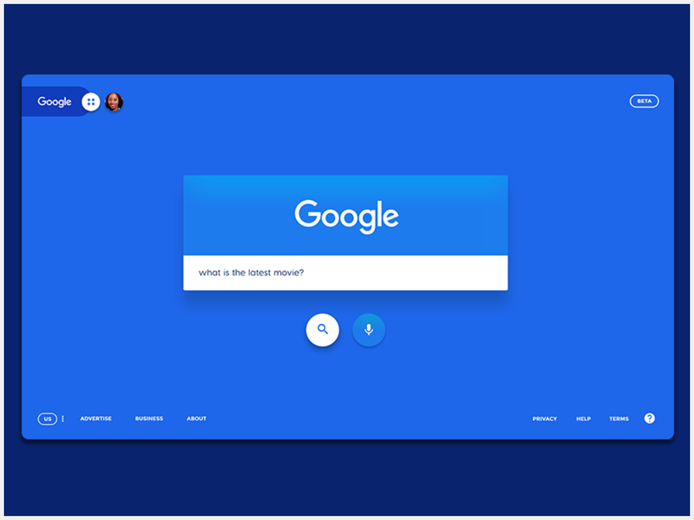
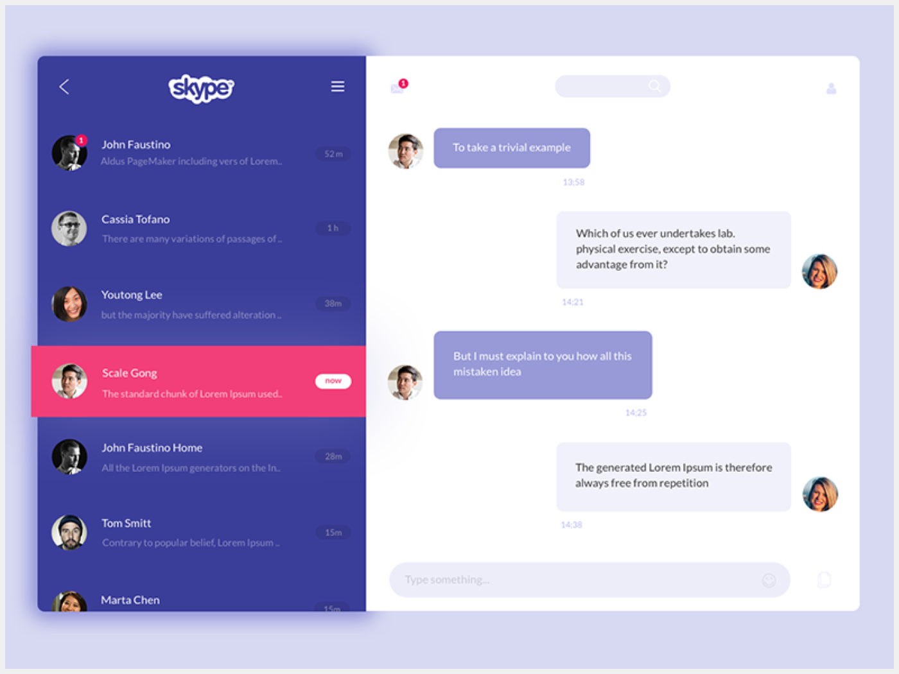
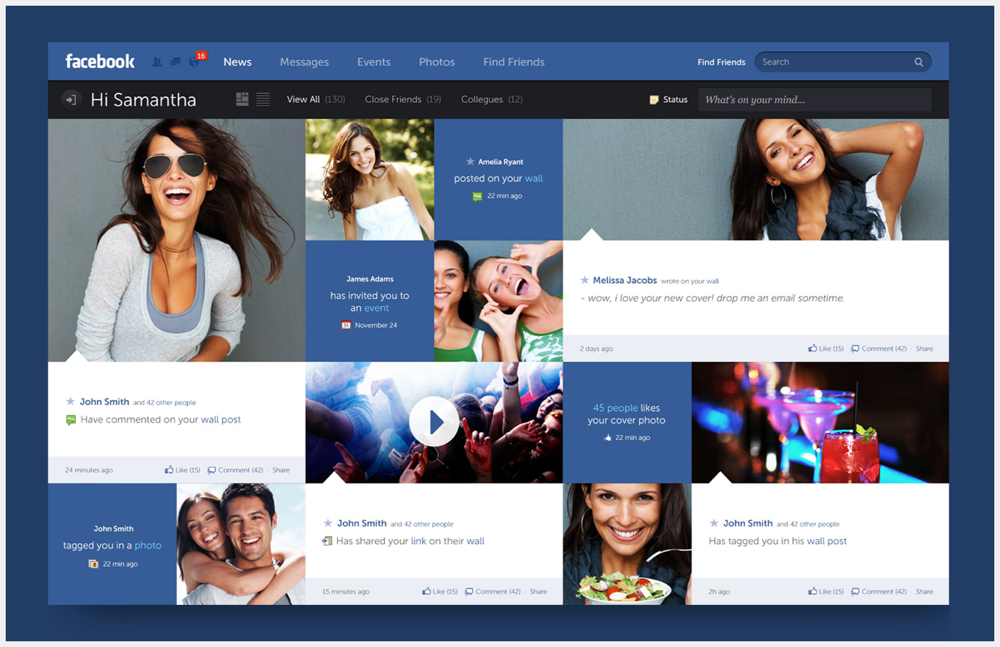

I’m tired of seeing new and frankly stupid redesigns of Facebook, Skype, and Twitter pop up on my newsfeed. Why not make something useful? Stop supporting these redesigns with likes, re-posts, and articles at Muzli, Medium, Designer News, etc. You’re aiding and abetting this brainless work. These designers may start to think that they are true professionals, and that they know more about how popular services should look than their creators.

**Disclaimer**: I don’t think that all redesigns have silly and unattractive UI, but I think that 99% of them do. If you read this article to the end, your redesign might just end up in the 1%.

From my perspective, people do redesigns of popular services because they:

- Want clicks
- Need to compensate for a flimsy portfolio
- Are looking for design experience

UI/UX work is not just about creating a beautiful picture. It’s about addressing your clients’ needs by providing new experiences for users and inspiring them to take action. It’s vital to do your research, discuss ideas with product managers, understand business needs, and check your assumptions. Only after all of that can you begin drawing.

Let me explain why lazy redesigns are not good PR for you, how to compile an impressive portfolio without doing silly work, and where to find real-world experience on projects that make the world a better place.

## Why redesigns are not good PR

If you are at the beginning of your career and lack a portfolio, coming up with a Facebook redesign concept may seem tempting. But, more likely than not, you will make a lot of mistakes that professional UI designers will spot immediately. Just take a look at these redesigns:

<!-- _[Google redesign](https://medium.muz.li/google-redesign-8947ccadab46)_ -->

For some reason, this designer decided to forget about branding and use a bold background color that looks pretty good but splits focus. They also moved the Account Settings to the left corner, when there is an established practice of placing it at the top right corner.

<!-- _[Skype redesign](https://medium.muz.li/skype-redesign-concepts-46972389979)_ -->

This is a Skype concept from Muzli. Again, we see that the designer forgot about branding and made Skype look too similar to Viber. I have no idea why there is a bold, purple and pink left panel. With this design, users are encouraged to focus more on the list of conversations than on their current chat.

The designer probably used these colors because they thought it looked cool. Stop it. Make it because it’s right, because it has meaning, because it will help users solve a problem, or because it will help sell your product. Don’t do it just because it looks cool!

<!-- _[Facebook redesign](https://medium.muz.li/facebook-redesign-concepts-ca694efff84f)_ -->

Another Facebook concept. These guys made tons of work, but I can’t imagine Facebook implementing these changes anytime soon. Dark colors, grid view, Apple-style gradient button, and no ads? Really?

But after you make it, you can post it on your website and trick potential clients into believing that you worked with Facebook or other big companies. It’s a very common trick.

A great example of how can you suffer from this is the guys at [flatstudio](http://flatstudio.co/). They created a redesign of the New York Times, started a special website for it, and posted it on Behance, Dribbble, and their own site. They probably wasted a few months on that work, but after just a few weeks, it was scrubbed from the internet. I guess someone at the New York Times sent them a warning. Now, you can only find their concept here.

These guys are very tricky, because on their website you can find Google, Microsoft, and Tesla logos, and make the (incorrect) assumption that they really worked with these companies. In reality, they only have redesign concepts.

If you decide to redesign a popular service anyway:

- Don’t forget about branding
- Try to get maximum analytics
- Incorporate monetization elements (ads, banners, etc.)
- Attempt to improve the entire user experience, not just UI

Take a look at [this woman’s approach](https://medium.freecodecamp.com/i-wanted-to-see-how-far-i-could-push-myself-creatively-so-i-redesigned-instagram-1ff99f28fa8b#.72jj409ck).

She did a lot of research and suggested really good UX improvements. She’s a great example of what you should do in a redesign.

How do you make the world a better place and get real experience?

Charitable foundations all over the world are trying to help people, but very often have terrible websites. I would guess that they’d love free design help, so offer your services! This is also a great way to improve your karma. :)

Don’t like that approach? You can also pick the websites of famous attractions and offer to help them. They have a lot of visitors every day, but often don’t have great sites.

Want to try designing for ecommerce sites? Let’s Google “flower delivery Paris” and pick a few poorly designed examples:

Don’t hesitate to message site owners or ask your friends, maybe they need your help. You will find a real project and get real experience. With this method, you will improve your communication skills, get valuable new contacts, and learn about analytics and client preferences firsthand.
