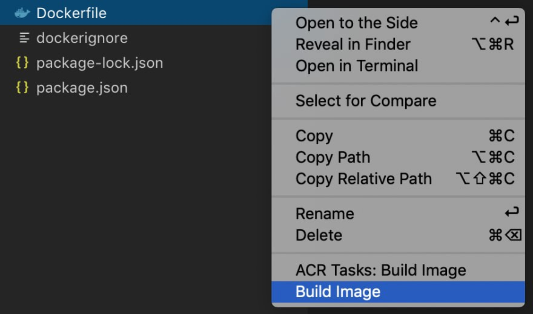
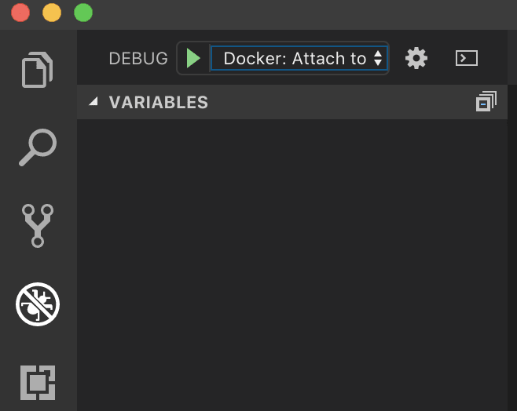

More and more teams are moving their development environments to Docker containers. It brings a lot of advantages, such as a unified environment shared between all devs, a faster onboarding process for new members, and predictable deployments. For example, in my previous article [“Microservices vs Monolith architecture”](/blog/microservices-vs-monolith-architecture), I made the point that with microservices you have to use Docker, because otherwise you’re launching multiple microservices on a local machine and development becomes a huge pain. When you have even 5–10 microservices, you run them through your terminal one by one and have to make sure that you have all dependencies, db, elasticsearch, etc., installed. Alternatively, you can get it running with one command using docker-compose, a much better approach.

But that approach requires you to understand Docker and to not miss the functionality or experience you had without it. One of the things to understand is how to debug within the Docker container. In this article, we will go through a few use cases related to debugging a
Node.js app in a docker container.

## Prerequirements

- VS Code
- Docker
- Docker extension for VS Code

## Cases

- Node.js, Docker, without Nodemon
- Node.js, Docker, Nodemon
- Node.js, Docker with docker-compose

## Node.js, Docker, without Nodemon

If you already have the Node.js app your Dockerfile, it probably looks like this:

```javascript
FROM node:10-alpineEXPOSE 3000WORKDIR /usr/src/appCOPY package*.json ./
RUN npm installCOPY . .CMD [ "npm", "start" ]
```

In order to continue, we need to build our Dockerfile. I recommend using the VS Code Docker extension and begin building as shown below:



To enable the debugger in Node.js, we need to use — inspect or — inspect-brk, but because our app will be launched inside Docker, we also need to allow access from external networks to our debugger by passing 0.0.0.0.

```javascript
"scripts": {
    "start": "node --inspect=0.0.0.0 index.js"
  },

```

Now, when you execute `npm start` it will run the node debugger on a separate port (by default 9229) you can then connect your debugger tool to. To access debugger, you have to also expose the 9229 port to your host machine. You could do it with the following command:

```bash
docker run --rm -d -p 3000:3000 -p 9229:9229 -v ${PWD}:/usr/src/app -v /usr/src/app/node_modules example:latest
```

With that command, we expose 3000 and 9229 ports of the Dockerized app to localhost, then we mount the current folder with the app to /usr/src/app and use a hack to prevent overriding of node modules from the local machine through Docker.

Now we could configure with the VS Code wizard debug launch task. Press CMD(Ctrl)+Shift+P(Command Palette) and find “Debug: Open launch.json”:


Then choose Docker: Node.js:


This will generate a launch.json file with the following content:

```javascript
{
    // Use IntelliSense to learn about possible attributes.
    // Hover to view descriptions of existing attributes.
    // For more information, visit: https://go.microsoft.com/fwlink/?linkid=830387
    "version": "0.2.0",
    "configurations": [
        {
            "name": "Docker: Attach to Node",
            "type": "node",
            "request": "attach",
            "port": 9229,
            "address": "localhost",
            "localRoot": "${workspaceFolder}",
            "remoteRoot": "/usr/src/app",
            "protocol": "inspector"
        }
    ]
}
```

The configuration for Docker is to manually attach to the debugger port and map the local root folder to remote in order to keep breakpoints definitions working.

Go to the Debug Page at VS code, press the “Play” button and enjoy debugging in Docker.

## Node.js, Docker, with Nodemon

The small difference comes when we want to use the debugger with nodemon. To start with, your script in package.json will look like this:

```javascript
"start": "nodemon --inspect=0.0.0.0 src/index.js",
```

Then, because nodemon will restart your app on each change, your debugger will lose a connection. When this happens, there is an option “restart: true”, which will cause you to simply attempt to reconnect to the debugger after each restart.

So your launch.json should look like this:

```javascript
{
    // Use IntelliSense to learn about possible attributes.
    // Hover to view descriptions of existing attributes.
    // For more information, visit: https://go.microsoft.com/fwlink/?linkid=830387
    "version": "0.2.0",
    "configurations": [
        {
            "name": "Docker: Attach to Node",
            "type": "node",
            "request": "attach",
            "port": 9229,
            "address": "localhost",
            "localRoot": "${workspaceFolder}",
            "remoteRoot": "/usr/src/app",
            "protocol": "inspector",
            "restart": true
        }
    ]
}
```

Go to Debug Page at VS code, press the “Play” button and, just as before, enjoy debugging in Docker.



## Node.js, Docker, with docker-compose

A third option is to run your docker images with docker-compose, which is good if your service also requires a database or other dependencies you can run with Docker.

Create a docker-compose.yaml in your app folder with the following content:

```javascript
version: '3'services:
  example-service:
    build: .
    volumes:
      - .:/usr/src/app
      - /usr/src/app/node_modules
    ports:
      - 3000:3000
      - 9229:9229
    command: npm start
```

We used basically the same instructions as we used for non docker-compose solution, just converted them in yaml format. Now you can continue with the launch.json file using nodemon or the node.js running option and use Debugger as described in previous sections.
